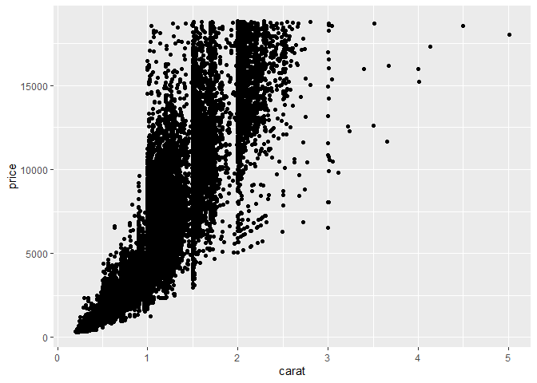
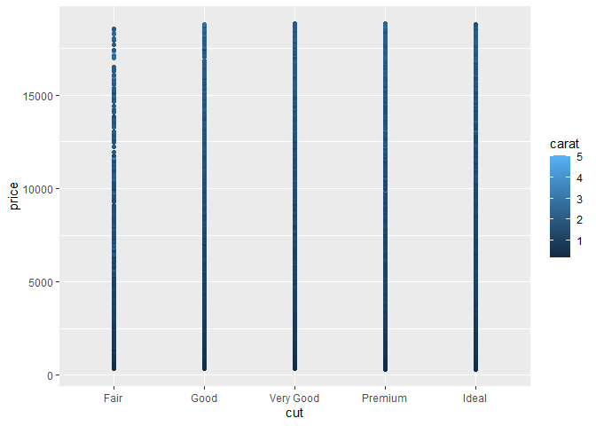

Getting Started: Diamonds
================
Maya McKone-Sweet
2025-02-03

- [Grading Rubric](#grading-rubric)
  - [Individual](#individual)
  - [Submission](#submission)
- [Data Exploration](#data-exploration)
  - [**q1** Create a plot of `price` vs `carat` of the `diamonds`
    dataset below. Document your observations from the
    visual.](#q1-create-a-plot-of-price-vs-carat-of-the-diamonds-dataset-below-document-your-observations-from-the-visual)
  - [**q2** Create a visualization showing variables `carat`, `price`,
    and `cut` simultaneously. Experiment with which variable you assign
    to which aesthetic (`x`, `y`, etc.) to find an effective
    visual.](#q2-create-a-visualization-showing-variables-carat-price-and-cut-simultaneously-experiment-with-which-variable-you-assign-to-which-aesthetic-x-y-etc-to-find-an-effective-visual)
- [Communication](#communication)
  - [**q3** *Knit* your document in order to create a
    report.](#q3-knit-your-document-in-order-to-create-a-report)
  - [**q4** *Push* your knitted document to
    GitHub.](#q4-push-your-knitted-document-to-github)
  - [**q5** *Submit* your work to
    Canvas](#q5-submit-your-work-to-canvas)
  - [**q6** *Prepare* to present your team’s
    findings!](#q6-prepare-to-present-your-teams-findings)

*Purpose*: Throughout this course, you’ll complete a large number of
*exercises* and *challenges*. Exercises are meant to introduce content
with easy-to-solve problems, while challenges are meant to make you
think more deeply about and apply the content. The challenges will start
out highly-scaffolded, and become progressively open-ended.

In this challenge, you will go through the process of exploring,
documenting, and sharing an analysis of a dataset. We will use these
skills again and again in each challenge.

*Note*: You will have seen all of these steps in `e-vis00-basics`. This
challenge is *primarily* a practice run of the submission system. The
Data Exploration part should be very simple.

<!-- include-rubric -->

# Grading Rubric

<!-- -------------------------------------------------- -->

Unlike exercises, **challenges will be graded**. The following rubrics
define how you will be graded, both on an individual and team basis.

## Individual

<!-- ------------------------- -->

| Category | Needs Improvement | Satisfactory |
|----|----|----|
| Effort | Some task **q**’s left unattempted | All task **q**’s attempted |
| Observed | Did not document observations, or observations incorrect | Documented correct observations based on analysis |
| Supported | Some observations not clearly supported by analysis | All observations clearly supported by analysis (table, graph, etc.) |
| Assessed | Observations include claims not supported by the data, or reflect a level of certainty not warranted by the data | Observations are appropriately qualified by the quality & relevance of the data and (in)conclusiveness of the support |
| Specified | Uses the phrase “more data are necessary” without clarification | Any statement that “more data are necessary” specifies which *specific* data are needed to answer what *specific* question |
| Code Styled | Violations of the [style guide](https://style.tidyverse.org/) hinder readability | Code sufficiently close to the [style guide](https://style.tidyverse.org/) |

## Submission

<!-- ------------------------- -->

Make sure to commit both the challenge report (`report.md` file) and
supporting files (`report_files/` folder) when you are done! Then submit
a link to Canvas. **Your Challenge submission is not complete without
all files uploaded to GitHub.**

``` r
library(tidyverse)
```

    ## ── Attaching core tidyverse packages ──────────────────────── tidyverse 2.0.0 ──
    ## ✔ dplyr     1.1.4     ✔ readr     2.1.5
    ## ✔ forcats   1.0.0     ✔ stringr   1.5.1
    ## ✔ ggplot2   3.5.1     ✔ tibble    3.2.1
    ## ✔ lubridate 1.9.4     ✔ tidyr     1.3.1
    ## ✔ purrr     1.0.2     
    ## ── Conflicts ────────────────────────────────────────── tidyverse_conflicts() ──
    ## ✖ dplyr::filter() masks stats::filter()
    ## ✖ dplyr::lag()    masks stats::lag()
    ## ℹ Use the conflicted package (<http://conflicted.r-lib.org/>) to force all conflicts to become errors

# Data Exploration

<!-- -------------------------------------------------- -->

In this first stage, you will explore the `diamonds` dataset and
document your observations.

### **q1** Create a plot of `price` vs `carat` of the `diamonds` dataset below. Document your observations from the visual.

*Hint*: We learned how to do this in `e-vis00-basics`!

``` r
## TASK: Plot `price` vs `carat` below
## Your code here!
diamonds  %>% 
  ggplot(aes(x = carat, y = price)) +
  geom_point()
```

<!-- -->

**Observations**:

- Price increases with carat but its not directly proportional. Form 0-1
  carat there is a pretty consistent trend yet for the 0.9ish carat the
  price ranges from about \$1250 to \$10,000. I need to look into the
  dataset diamonds to see if there are other variables.
- There are trends in exact carat cut of each of the diamonds. These are
  common cuts like 1.5, 1, or 2 and less common cuts around 1.85, 2.75,
  etc. You can tell this by seeing how many diamonds are aligned
  vertically for a carat value.

### **q2** Create a visualization showing variables `carat`, `price`, and `cut` simultaneously. Experiment with which variable you assign to which aesthetic (`x`, `y`, etc.) to find an effective visual.

``` r
## TASK: Plot `price`, `carat`, and `cut` below
## Your code here!
diamonds  %>% 
  ggplot(aes(x = cut, y = price, color = carat)) +
  geom_point()
```

<!-- -->

``` r
diamonds  %>% 
  ggplot(aes(x = carat, y = price, color = cut)) +
  geom_point()
```

<!-- -->

**Observations**:

- Price generally increases with carat. The nicer the cut the higher the
  price of the diamond. This is the same as my observations as the graph
  above.
- Cut influences the price and explains why price and carat are not
  directly proportional.
- When I put cut on the x-axis and price on the y-axis I see a gradual
  color gradient from low price to high price based on the carat of the
  diamond. For one cut type as the price increases the carat also tends
  to increase. For a fair cut the carats start increasing earlier then
  when compared to the ideal cut where the highest carat is only about
  three.
- When we change the graph to have price on the y-axis and carat on the
  x-axis there is a more complex relationship at play. It was color
  coded by cut type as well. It is not easy to draw conclusion about how
  cut affects the price. It tends to show that nicer cuts relate to
  higher prices but it is not definitive. It does show a general upward
  trend that as carat increases so does price. It is not a linear
  relationship but look to be somewhat corelated. I would have to look
  more into how the other variables affect price to know how much carat
  has to do with the price.

# Communication

<!-- -------------------------------------------------- -->

In this next stage, you will render your data exploration, push it to
GitHub to share with others, and link your observations within our [Data
Science
Wiki](https://olin-data-science.fandom.com/wiki/Olin_Data_Science_Wiki).

### **q3** *Knit* your document in order to create a report.

You can do this by clicking the “Knit” button at the top of your
document in RStudio.

<figure>

<figcaption aria-hidden="true">Terminal</figcaption>
</figure>

This will create a local `.md` file, and RStudio will automatically open
a preview window so you can view your knitted document.

### **q4** *Push* your knitted document to GitHub.

<figure>

<figcaption aria-hidden="true">Terminal</figcaption>
</figure>

You will need to stage both the `.md` file, as well as the `_files`
folder. Note that the `_files` folder, when staged, will expand to
include all the files under that directory.

<figure>

<figcaption aria-hidden="true">Terminal</figcaption>
</figure>

### **q5** *Submit* your work to Canvas

Navigate to your GitHub repository’s website and find the URL that
corresponds to your report. Submit this to Canvas to complete the
assignment.

### **q6** *Prepare* to present your team’s findings!

If your team is on-deck, you are responsible for putting together a
discussion of the challenge. I’ll demonstrate how to do this by leading
the discussion of Challenge 0.
