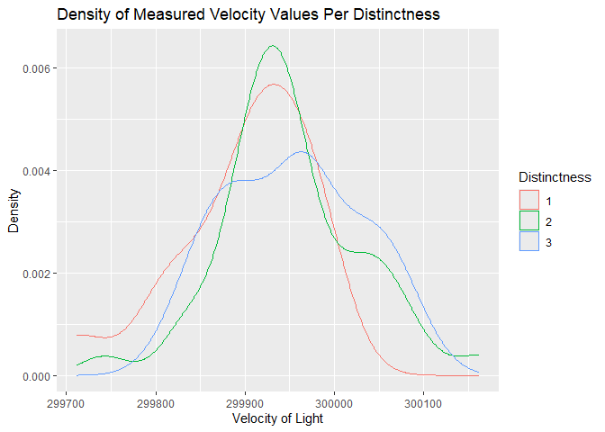
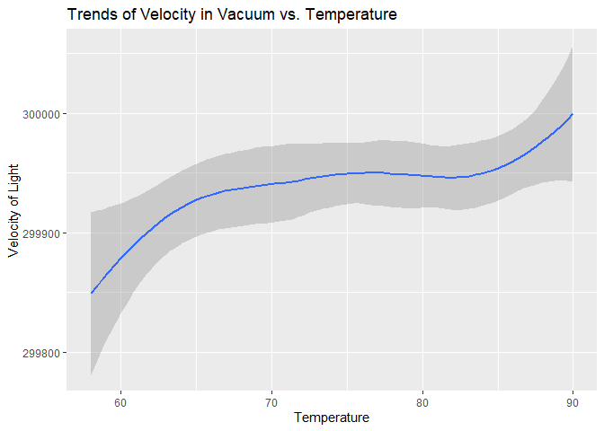
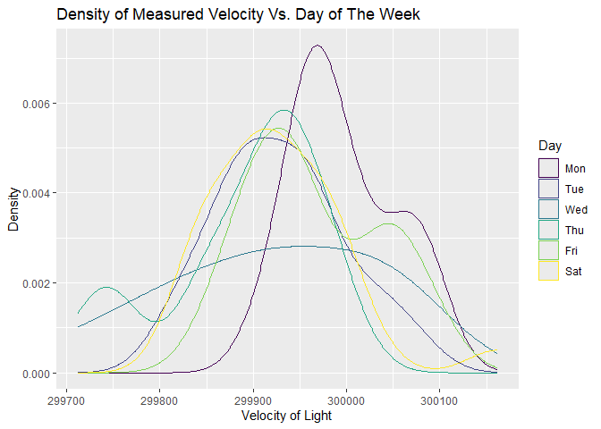
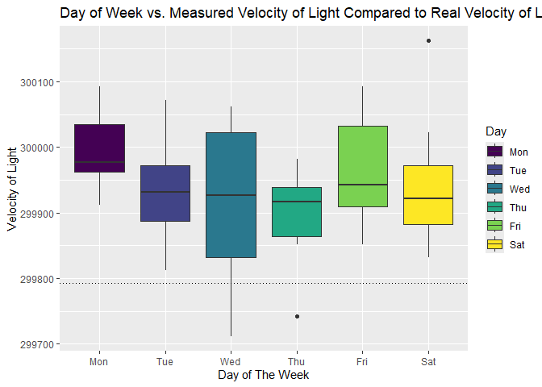

Michelson Speed-of-light Measurements
================
(Your name here)
2020-

- [Grading Rubric](#grading-rubric)
  - [Individual](#individual)
  - [Submission](#submission)
    - [**q1** Re-create the following table (from Michelson (1880),
      pg. 139) using `df_michelson` and `dplyr`. Note that your values
      *will not* match those of Michelson *exactly*; why might this
      be?](#q1-re-create-the-following-table-from-michelson-1880-pg-139-using-df_michelson-and-dplyr-note-that-your-values-will-not-match-those-of-michelson-exactly-why-might-this-be)
    - [**q2** Create a new variable `VelocityVacuum` with the $+92$ km/s
      adjustment to `Velocity`. Assign this new dataframe to
      `df_q2`.](#q2-create-a-new-variable-velocityvacuum-with-the-92-kms-adjustment-to-velocity-assign-this-new-dataframe-to-df_q2)
    - [**q3** Compare Michelson’s speed of light estimate against the
      modern speed of light value. Is Michelson’s estimate of the error
      (his uncertainty) greater or less than the true
      error?](#q3-compare-michelsons-speed-of-light-estimate-against-the-modern-speed-of-light-value-is-michelsons-estimate-of-the-error-his-uncertainty-greater-or-less-than-the-true-error)
    - [**q4** Inspect the following plot with the `Real` Michelson data
      and `Simulated` data from a probability model. Document the
      similarities and differences between the data under *observe*
      below.](#q4-inspect-the-following-plot-with-the-real-michelson-data-and-simulated-data-from-a-probability-model-document-the-similarities-and-differences-between-the-data-under-observe-below)
    - [**q5** You have access to a few other variables. Construct a **at
      least three** visualizations of `VelocityVacuum` against these
      other factors. Are there other patterns in the data that might
      help explain the difference between Michelson’s estimate and
      `LIGHTSPEED_VACUUM`?](#q5-you-have-access-to-a-few-other-variables-construct-a-at-least-three-visualizations-of-velocityvacuum-against-these-other-factors-are-there-other-patterns-in-the-data-that-might-help-explain-the-difference-between-michelsons-estimate-and-lightspeed_vacuum)
  - [Bibliography](#bibliography)

*Purpose*: When studying physical problems, there is an important
distinction between *error* and *uncertainty*. The primary purpose of
this challenge is to dip our toes into these factors by analyzing a real
dataset.

*Reading*: [Experimental Determination of the Velocity of
Light](https://play.google.com/books/reader?id=343nAAAAMAAJ&hl=en&pg=GBS.PA115)
(Optional)

<!-- include-rubric -->

# Grading Rubric

<!-- -------------------------------------------------- -->

Unlike exercises, **challenges will be graded**. The following rubrics
define how you will be graded, both on an individual and team basis.

## Individual

<!-- ------------------------- -->

| Category | Needs Improvement | Satisfactory |
|----|----|----|
| Effort | Some task **q**’s left unattempted | All task **q**’s attempted |
| Observed | Did not document observations, or observations incorrect | Documented correct observations based on analysis |
| Supported | Some observations not clearly supported by analysis | All observations clearly supported by analysis (table, graph, etc.) |
| Assessed | Observations include claims not supported by the data, or reflect a level of certainty not warranted by the data | Observations are appropriately qualified by the quality & relevance of the data and (in)conclusiveness of the support |
| Specified | Uses the phrase “more data are necessary” without clarification | Any statement that “more data are necessary” specifies which *specific* data are needed to answer what *specific* question |
| Code Styled | Violations of the [style guide](https://style.tidyverse.org/) hinder readability | Code sufficiently close to the [style guide](https://style.tidyverse.org/) |

## Submission

<!-- ------------------------- -->

Make sure to commit both the challenge report (`report.md` file) and
supporting files (`report_files/` folder) when you are done! Then submit
a link to Canvas. **Your Challenge submission is not complete without
all files uploaded to GitHub.**

``` r
# Libraries
library(tidyverse)
library(googlesheets4)

url <- "https://docs.google.com/spreadsheets/d/1av_SXn4j0-4Rk0mQFik3LLr-uf0YdA06i3ugE6n-Zdo/edit?usp=sharing"

# Parameters
LIGHTSPEED_VACUUM    <- 299792.458 # Exact speed of light in a vacuum (km / s)
LIGHTSPEED_MICHELSON <- 299944.00  # Michelson's speed estimate (km / s)
LIGHTSPEED_PM        <- 51         # Michelson error estimate (km / s)
```

*Background*: In 1879 Albert Michelson led an experimental campaign to
measure the speed of light. His approach was a development upon the
method of Foucault\[3\], and resulted in a new estimate of
$v_0 = 299944 \pm 51$ kilometers per second (in a vacuum). This is very
close to the modern *exact* value of 2.9979246^{5}. In this challenge,
you will analyze Michelson’s original data, and explore some of the
factors associated with his experiment.

I’ve already copied Michelson’s data from his 1880 publication; the code
chunk below will load these data from a public googlesheet.

*Aside*: The speed of light is *exact* (there is **zero error** in the
value `LIGHTSPEED_VACUUM`) because the meter is actually
[*defined*](https://en.wikipedia.org/wiki/Metre#Speed_of_light_definition)
in terms of the speed of light!

``` r
## Note: No need to edit this chunk!
gs4_deauth()
ss <- gs4_get(url)
df_michelson <-
  read_sheet(ss) %>%
  select(Date, Distinctness, Temp, Velocity) %>%
  mutate(Distinctness = as_factor(Distinctness))
```

    ## ✔ Reading from "michelson1879".

    ## ✔ Range 'Sheet1'.

``` r
df_michelson %>% glimpse()
```

    ## Rows: 100
    ## Columns: 4
    ## $ Date         <dttm> 1879-06-05, 1879-06-07, 1879-06-07, 1879-06-07, 1879-06-…
    ## $ Distinctness <fct> 3, 2, 2, 2, 2, 2, 3, 3, 3, 3, 2, 2, 2, 2, 2, 1, 3, 3, 2, …
    ## $ Temp         <dbl> 76, 72, 72, 72, 72, 72, 83, 83, 83, 83, 83, 90, 90, 71, 7…
    ## $ Velocity     <dbl> 299850, 299740, 299900, 300070, 299930, 299850, 299950, 2…

*Data dictionary*:

- `Date`: Date of measurement
- `Distinctness`: Distinctness of measured images: 3 = good, 2 = fair, 1
  = poor
- `Temp`: Ambient temperature (Fahrenheit)
- `Velocity`: Measured speed of light (km / s)

### **q1** Re-create the following table (from Michelson (1880), pg. 139) using `df_michelson` and `dplyr`. Note that your values *will not* match those of Michelson *exactly*; why might this be?

| Distinctness | n   | MeanVelocity |
|--------------|-----|--------------|
| 3            | 46  | 299860       |
| 2            | 39  | 299860       |
| 1            | 15  | 299810       |

``` r
## TODO: Compute summaries
df_q1 <- df_michelson %>% 
  group_by(Distinctness) %>% 
  summarize(
    n = n(),
    MeanVelocity = mean(Velocity)
  )

  
df_q1 %>%
  arrange(desc(Distinctness)) %>%
  knitr::kable()
```

| Distinctness |   n | MeanVelocity |
|:-------------|----:|-------------:|
| 3            |  46 |     299861.7 |
| 2            |  39 |     299858.5 |
| 1            |  15 |     299808.0 |

**Observations**:

- Write your observations here!

  - The data in the first two columns are identical to the given table.
    The Mean Velocity Values are off by a few numbers.

- Why might your table differ from Michelson’s?

  - It could be taking different amount into their calculation of the
    mean data. Potentially when transferring the data we forgot a few
    lines. I assume it is due to different ways of calculating mean or
    difference in the data we are analyzing.
  - This error could also be due to difference in methods of rounding
    with the data. That would explain the why the numbers are only
    slightly off (about 1-2)

The `Velocity` values in the dataset are the speed of light *in air*;
Michelson introduced a couple of adjustments to estimate the speed of
light in a vacuum. In total, he added $+92$ km/s to his mean estimate
for `VelocityVacuum` (from Michelson (1880), pg. 141). While the
following isn’t fully rigorous ($+92$ km/s is based on the mean
temperature), we’ll simply apply this correction to all the observations
in the dataset.

### **q2** Create a new variable `VelocityVacuum` with the $+92$ km/s adjustment to `Velocity`. Assign this new dataframe to `df_q2`.

``` r
## TODO: Adjust the data, assign to df_q2
df_q2 <- df_michelson %>% 
  mutate(
  VelocityVacuum = Velocity + 92
  ) 

df_q2 %>% 
  arrange(desc(Distinctness))
```

    ## # A tibble: 100 × 5
    ##    Date                Distinctness  Temp Velocity VelocityVacuum
    ##    <dttm>              <fct>        <dbl>    <dbl>          <dbl>
    ##  1 1879-06-05 00:00:00 3               76   299850         299942
    ##  2 1879-06-09 00:00:00 3               83   299950         300042
    ##  3 1879-06-09 00:00:00 3               83   299980         300072
    ##  4 1879-06-09 00:00:00 3               83   299980         300072
    ##  5 1879-06-09 00:00:00 3               83   299880         299972
    ##  6 1879-06-13 00:00:00 3               72   300000         300092
    ##  7 1879-06-13 00:00:00 3               72   300000         300092
    ##  8 1879-06-13 00:00:00 3               79   299960         300052
    ##  9 1879-06-13 00:00:00 3               79   299960         300052
    ## 10 1879-06-13 00:00:00 3               79   299940         300032
    ## # ℹ 90 more rows

As part of his study, Michelson assessed the various potential sources
of error, and provided his best-guess for the error in his
speed-of-light estimate. These values are provided in
`LIGHTSPEED_MICHELSON`—his nominal estimate—and
`LIGHTSPEED_PM`—plus/minus bounds on his estimate. Put differently,
Michelson believed the true value of the speed-of-light probably lay
between `LIGHTSPEED_MICHELSON - LIGHTSPEED_PM` and
`LIGHTSPEED_MICHELSON + LIGHTSPEED_PM`.

Let’s introduce some terminology:\[2\]

- **Error** is the difference between a true value and an estimate of
  that value; for instance `LIGHTSPEED_VACUUM - LIGHTSPEED_MICHELSON`.
- **Uncertainty** is an analyst’s *assessment* of the error.

Since a “true” value is often not known in practice, one generally does
not know the error. The best they can do is quantify their degree of
uncertainty. We will learn some means of quantifying uncertainty in this
class, but for many real problems uncertainty includes some amount of
human judgment.\[2\]

### **q3** Compare Michelson’s speed of light estimate against the modern speed of light value. Is Michelson’s estimate of the error (his uncertainty) greater or less than the true error?

``` r
## TODO: Compare Michelson's estimate and error against the true value
## Your code here!

tibble(
  Michelson_LIGHTSPEED = LIGHTSPEED_MICHELSON,
  LowerBound = LIGHTSPEED_MICHELSON - LIGHTSPEED_PM,
  UpperBound = LIGHTSPEED_MICHELSON + LIGHTSPEED_PM,
  Vacuum_LIGHTSPEED = LIGHTSPEED_VACUUM,
  Error = LIGHTSPEED_VACUUM - LIGHTSPEED_MICHELSON,
  Ratio = LIGHTSPEED_PM / Error
)
```

    ## # A tibble: 1 × 6
    ##   Michelson_LIGHTSPEED LowerBound UpperBound Vacuum_LIGHTSPEED Error  Ratio
    ##                  <dbl>      <dbl>      <dbl>             <dbl> <dbl>  <dbl>
    ## 1               299944     299893     299995           299792. -152. -0.337

``` r
# print(LowerBound)
# print(UpperBound)
# print(LIGHTSPEED_VACUUM)
```

**Observations**:

- Is Michelson’s estimate of the error (his uncertainty) greater or less
  than the true error?

  - Michelson’s uncertainty is greater than the true error. His speed
    and the lower/upper bound do not include the actual vacuum light
    speed. There is an Error of -151.54.

- Make a quantitative comparison between Michelson’s uncertainty and his
  error.

  - Michelson’s data is uncertain as in all of its measurements has a +-
    51 value range from the average. In addition to this none of the
    data measurements are in the bounds of the Vacuum Light Speed.
    Michelson’s error was larger than his estimation of the error (aka
    his uncertainty). His data was off from the actual value but in the
    grand scheme of scale the numbers are surprisingly close.
  - The ratio between uncertainty and error is 0.336. This means the
    uncertainty is not great enough to account for the full error in the
    measurements. The uncertainty can account for what could be
    considered 33% of the error. aka the uncertainty can take the
    results to be closer to the actual speed of light but does not make
    them the same.

The following plot shows all of Michelson’s data as a [control
chart](https://en.wikipedia.org/wiki/Control_chart); this sort of plot
is common in manufacturing, where it is used to help determine if a
manufacturing process is under [statistical
control](https://en.wikipedia.org/wiki/Statistical_process_control).
Each dot is one of Michelson’s measurements, and the grey line connects
the mean taken for each day. The same plot also shows simulated data
using a probability model. We’ll get into statistics later in the
course; for now, let’s focus on understanding what real and simulated
data tend to look like.

### **q4** Inspect the following plot with the `Real` Michelson data and `Simulated` data from a probability model. Document the similarities and differences between the data under *observe* below.

``` r
## Note: No need to edit this chunk!
## Calibrate simulated data
v_mean <-
  df_q2 %>%
  summarize(m = mean(VelocityVacuum)) %>%
  pull(m)
v_sd <-
  df_q2 %>%
  summarize(s = sd(VelocityVacuum)) %>%
  pull(s)

## Visualize
set.seed(101)
df_q2 %>%
  mutate(Simulated = rnorm(n(), mean = v_mean, sd = v_sd)) %>%
  rename(Real = VelocityVacuum) %>%
  pivot_longer(
    cols = c(Simulated, Real),
    names_to = "source",
    values_to = "velocity"
  ) %>%

  ggplot(aes(Date, velocity)) +
  geom_hline(
    yintercept = LIGHTSPEED_MICHELSON,
    linetype = "dotted"
  ) +
  geom_hline(
    yintercept = LIGHTSPEED_MICHELSON - LIGHTSPEED_PM,
    linetype = "dashed"
  ) +
  geom_hline(
    yintercept = LIGHTSPEED_MICHELSON + LIGHTSPEED_PM,
    linetype = "dashed"
  ) +

  geom_line(
    data = . %>%
      group_by(Date, source) %>%
      summarize(velocity_mean = mean(velocity)),
    mapping = aes(y = velocity_mean),
    color = "grey50"
  ) +
  geom_point(
    mapping = aes(y = velocity),
    size = 0.8
  ) +

  facet_grid(source~.) +
  theme_minimal() +
  labs(
    x = "Date of Measurement (1879)",
    y = "Velocity (in Vacuum)"
  )
```

    ## `summarise()` has grouped output by 'Date'. You can override using the
    ## `.groups` argument.

<!-- -->

**Observations**:

- Similarities

  - Both graphs have large portions of the trend line between the upper
    and lower bound of the data.

  - Large spread of data points on any given day on either side of the
    average data line

- Differences

  - The peaks outside of the upper and lower bounds are on different
    dates.

  - The actual points of data are different and the simulated looks like
    it has more variation

### **q5** You have access to a few other variables. Construct a **at least three** visualizations of `VelocityVacuum` against these other factors. Are there other patterns in the data that might help explain the difference between Michelson’s estimate and `LIGHTSPEED_VACUUM`?

``` r
df_q2 %>%
  ggplot(aes(VelocityVacuum, color = Distinctness)) +
  geom_density() +
  labs(title = "Density of Measured Velocity Values Per Distinctness", x = "Velocity of Light", y = "Density")
```

<!-- -->

``` r
df_q2 %>% 
  ggplot(aes( x = Temp, y =VelocityVacuum)) +
  geom_smooth() +
  labs(title = "Trends of Velocity in Vacuum vs. Temperature", x = "Temperature", y = "Velocity of Light")
```

    ## `geom_smooth()` using method = 'loess' and formula = 'y ~ x'

<!-- -->

**Observations Part 1**:

- Graph 1: Distinctness 3 is the highest quality data measurement. Yet
  its density is spread out rather than peaking towards one velocity.
  Distinctness 1 and 2 which are lower quality data measurements have
  distinct peaks where there is a clear trend along the data. This is
  the opposite of what I assumed would be true. I assumed the higher
  quality data would have less variation than the lower quality
  measurements. I could look into this as it could explain the
  difference between VelocityVacuum and Michelson’s data.

- Graph 2: Originally I made a smooth line graph of each distinctness. I
  ended up combining them into one trend line because there was too much
  variation in the data to make any accurate observations. This graph
  shows me that on the low range of data and high range (\<65 and \>85)
  there is a more exponential relationship between temperature and the
  measured velocity in the vacuum. This is puzzling because in a vacuum
  we do not expect a change in speed of light due to temperature. In a
  median like air we might see a significantly small change due to the
  index of refraction. The trend on this graph is far more dramatic than
  that trend and comes from already untrustworthy data. We should not
  draw any claims about temperature having an effect on speed of light
  based on this data. Temperature does not affect the actual speed of
  light from my knowledge. From 65-85 degrees the velocity is tends to
  be consistent (in +- 15 from an average of about 299940). There is
  potential error in this smooth line graph as seen by the shaded
  regions and thus more analysis could be done.

``` r
df_q5 <- 
  df_q2 %>%
  mutate(
    Day = wday(Date, label = TRUE)
  )

#plot density vs day of week
df_q5 %>%
  ggplot(aes(VelocityVacuum, color = Day)) +
  geom_density() +
  labs(title = "Density of Measured Velocity Vs. Day of The Week", x = "Velocity of Light", y = "Density")
```

<!-- -->

``` r
df_q5 %>%
  ggplot(aes(x = Day, y = VelocityVacuum, fill = Day)) +
  geom_boxplot() +
  geom_hline(
    yintercept = LIGHTSPEED_VACUUM,
    linetype = "dotted"
  ) +
  labs(title = "Day of Week vs. Measured Velocity of Light Compared to Real Velocity of Light", x = "Day of The Week", y = "Velocity of Light")
```

<!-- -->

**Observations Part 2**:

- Graph 3: The trend density of velocity of the light is given for each
  day. Monday has the highest peak density yet has another bump.
  Wednesday is the most spread out over all the days meaning it tends to
  have the most variation in its data. Saturday, Thursday, and Tuesday
  follow similar trends with one peak at a velocity of roughly 299925.
  This shows that on those days they had the most similar data results.
  The data variation could potentially be due to different scientist
  taking the data on different days as most likely multiple people took
  data points. To understand the data trends per day we need to look at
  graph 4.
- Graph 4: As stated in graph 3, Wednesday has the most variation as
  seen in its box plot. Monday and Thursday do not average around the
  same velocity but they have the least amount of variation. All box
  plots but Monday tend to have a mean data line around the same range.
  Monday has distinct separation from the other days. Thursday and
  Saturday have outlier data that is not take into account in the box
  plot and I wonder if that is due to instrumentation error and human
  error. The dotted line is the actual velocity of light. The only box +
  whisker plot that overlaps at all is Wednesday which is the day with
  the most variation. It shows that no matter the day all data tends to
  measure above the actual velocity of light. Day of the week could have
  a slight influence over the variation in data but does not explain why
  the data was so far from the actual velocity of light.

## Bibliography

- \[1\] Michelson, [Experimental Determination of the Velocity of
  Light](https://play.google.com/books/reader?id=343nAAAAMAAJ&hl=en&pg=GBS.PA115)
  1880) 
- \[2\] Henrion and Fischhoff, [Assessing Uncertainty in Physical
  Constants](https://www.cmu.edu/epp/people/faculty/research/Fischoff-Henrion-Assessing%20uncertainty%20in%20physical%20constants.pdf)
  1986) 
- \[3\] BYU video about a [Fizeau-Foucault
  apparatus](https://www.youtube.com/watch?v=Ik5ORaaeaME), similar to
  what Michelson used.
