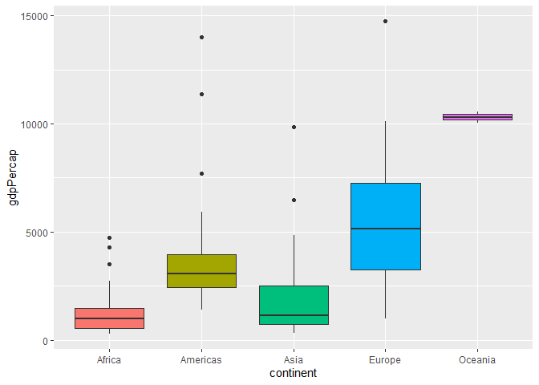
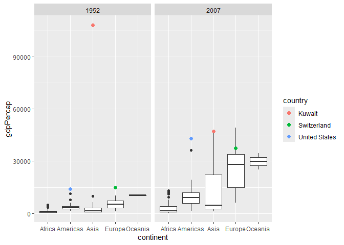
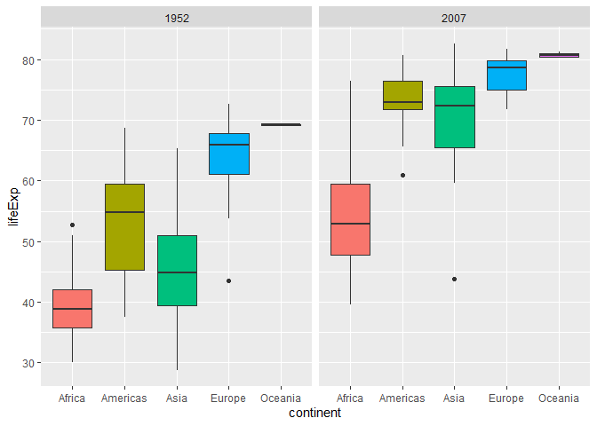
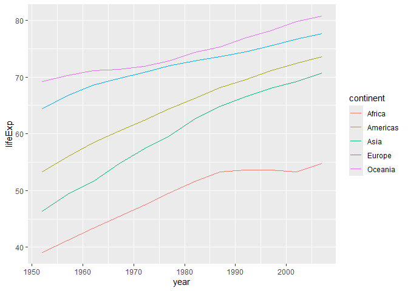
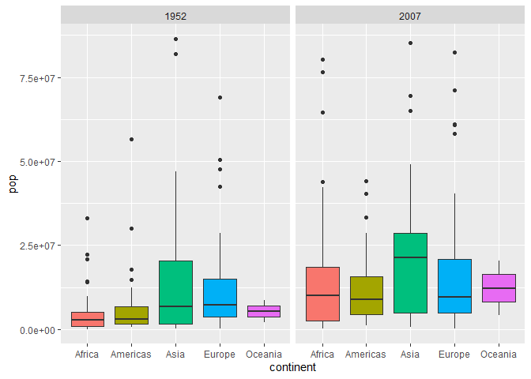

Gapminder
================
(Your name here)
2020-

- [Grading Rubric](#grading-rubric)
  - [Individual](#individual)
  - [Submission](#submission)
- [Guided EDA](#guided-eda)
  - [**q0** Perform your “first checks” on the dataset. What variables
    are in
    this](#q0-perform-your-first-checks-on-the-dataset-what-variables-are-in-this)
  - [**q1** Determine the most and least recent years in the `gapminder`
    dataset.](#q1-determine-the-most-and-least-recent-years-in-the-gapminder-dataset)
  - [**q2** Filter on years matching `year_min`, and make a plot of the
    GDP per capita against continent. Choose an appropriate `geom_` to
    visualize the data. What observations can you
    make?](#q2-filter-on-years-matching-year_min-and-make-a-plot-of-the-gdp-per-capita-against-continent-choose-an-appropriate-geom_-to-visualize-the-data-what-observations-can-you-make)
  - [**q3** You should have found *at least* three outliers in q2 (but
    possibly many more!). Identify those outliers (figure out which
    countries they
    are).](#q3-you-should-have-found-at-least-three-outliers-in-q2-but-possibly-many-more-identify-those-outliers-figure-out-which-countries-they-are)
  - [**q4** Create a plot similar to yours from q2 studying both
    `year_min` and `year_max`. Find a way to highlight the outliers from
    q3 on your plot *in a way that lets you identify which country is
    which*. Compare the patterns between `year_min` and
    `year_max`.](#q4-create-a-plot-similar-to-yours-from-q2-studying-both-year_min-and-year_max-find-a-way-to-highlight-the-outliers-from-q3-on-your-plot-in-a-way-that-lets-you-identify-which-country-is-which-compare-the-patterns-between-year_min-and-year_max)
- [Your Own EDA](#your-own-eda)
  - [**q5** Create *at least* three new figures below. With each figure,
    try to pose new questions about the
    data.](#q5-create-at-least-three-new-figures-below-with-each-figure-try-to-pose-new-questions-about-the-data)

*Purpose*: Learning to do EDA well takes practice! In this challenge
you’ll further practice EDA by first completing a guided exploration,
then by conducting your own investigation. This challenge will also give
you a chance to use the wide variety of visual tools we’ve been
learning.

<!-- include-rubric -->

# Grading Rubric

<!-- -------------------------------------------------- -->

Unlike exercises, **challenges will be graded**. The following rubrics
define how you will be graded, both on an individual and team basis.

## Individual

<!-- ------------------------- -->

| Category | Needs Improvement | Satisfactory |
|----|----|----|
| Effort | Some task **q**’s left unattempted | All task **q**’s attempted |
| Observed | Did not document observations, or observations incorrect | Documented correct observations based on analysis |
| Supported | Some observations not clearly supported by analysis | All observations clearly supported by analysis (table, graph, etc.) |
| Assessed | Observations include claims not supported by the data, or reflect a level of certainty not warranted by the data | Observations are appropriately qualified by the quality & relevance of the data and (in)conclusiveness of the support |
| Specified | Uses the phrase “more data are necessary” without clarification | Any statement that “more data are necessary” specifies which *specific* data are needed to answer what *specific* question |
| Code Styled | Violations of the [style guide](https://style.tidyverse.org/) hinder readability | Code sufficiently close to the [style guide](https://style.tidyverse.org/) |

## Submission

<!-- ------------------------- -->

Make sure to commit both the challenge report (`report.md` file) and
supporting files (`report_files/` folder) when you are done! Then submit
a link to Canvas. **Your Challenge submission is not complete without
all files uploaded to GitHub.**

``` r
library(tidyverse)
```

    ## ── Attaching core tidyverse packages ──────────────────────── tidyverse 2.0.0 ──
    ## ✔ dplyr     1.1.4     ✔ readr     2.1.5
    ## ✔ forcats   1.0.0     ✔ stringr   1.5.1
    ## ✔ ggplot2   3.5.1     ✔ tibble    3.2.1
    ## ✔ lubridate 1.9.4     ✔ tidyr     1.3.1
    ## ✔ purrr     1.0.2     
    ## ── Conflicts ────────────────────────────────────────── tidyverse_conflicts() ──
    ## ✖ dplyr::filter() masks stats::filter()
    ## ✖ dplyr::lag()    masks stats::lag()
    ## ℹ Use the conflicted package (<http://conflicted.r-lib.org/>) to force all conflicts to become errors

``` r
library(gapminder)
```

*Background*: [Gapminder](https://www.gapminder.org/about-gapminder/) is
an independent organization that seeks to educate people about the state
of the world. They seek to counteract the worldview constructed by a
hype-driven media cycle, and promote a “fact-based worldview” by
focusing on data. The dataset we’ll study in this challenge is from
Gapminder.

# Guided EDA

<!-- -------------------------------------------------- -->

First, we’ll go through a round of *guided EDA*. Try to pay attention to
the high-level process we’re going through—after this guided round
you’ll be responsible for doing another cycle of EDA on your own!

### **q0** Perform your “first checks” on the dataset. What variables are in this

dataset?

``` r
## TASK: Do your "first checks" here!
gapminder %>% 
  colnames()
```

    ## [1] "country"   "continent" "year"      "lifeExp"   "pop"       "gdpPercap"

**Observations**:

- Write all variable names here
  - Country
  - Continent
  - Year
  - Life Expectancy
  - Population
  - GDP Per Capita

### **q1** Determine the most and least recent years in the `gapminder` dataset.

*Hint*: Use the `pull()` function to get a vector out of a tibble.
(Rather than the `$` notation of base R.)

``` r
## TASK: Find the largest and smallest values of `year` in `gapminder`
year_max <- 
  gapminder %>% 
  pull(year) %>% 
  max()

year_min <-
  gapminder %>% 
  pull(year) %>% 
  min()
```

Use the following test to check your work.

``` r
## NOTE: No need to change this
assertthat::assert_that(year_max %% 7 == 5)
```

    ## [1] TRUE

``` r
assertthat::assert_that(year_max %% 3 == 0)
```

    ## [1] TRUE

``` r
assertthat::assert_that(year_min %% 7 == 6)
```

    ## [1] TRUE

``` r
assertthat::assert_that(year_min %% 3 == 2)
```

    ## [1] TRUE

``` r
if (is_tibble(year_max)) {
  print("year_max is a tibble; try using `pull()` to get a vector")
  assertthat::assert_that(False)
}

print("Nice!")
```

    ## [1] "Nice!"

### **q2** Filter on years matching `year_min`, and make a plot of the GDP per capita against continent. Choose an appropriate `geom_` to visualize the data. What observations can you make?

You may encounter difficulties in visualizing these data; if so document
your challenges and attempt to produce the most informative visual you
can.

``` r
## TASK: Create a visual of gdpPercap vs continent
gapminder %>%
  filter(year == year_min) %>%
  filter(gdpPercap < max(gdpPercap)) %>%
  ggplot(aes(continent, gdpPercap, fill = continent)) +
  geom_boxplot() + 
  theme(legend.position = "none")
```

<!-- -->

``` r
gapminder %>% 
  filter(year == year_min) %>% 
  ggplot(aes(continent, gdpPercap, fill = continent)) +
  geom_boxplot() + 
  scale_y_log10() + 
  theme(legend.position = "none")
```

<!-- -->

**Observations**:

- The log scale graph and the raw data graph show the same trends which
  I will state later. The way they show “outliers” and the variation in
  the gdp seems to differ even though the math done is the same.

Observations based on the 1st graph

- Oceania trends higher with a small spread. It only has 2 data points.
- Europe has the largest spread in terms of median and upper and lower
  quartiles
- Africa and Asia have the lowest median gdp’s

**Difficulties & Approaches**:

- I had to remove the highest gdp if I wanted to use a raw scaled plot.
  Using a log scale allows me to keep the outlier data. Other than that
  this went smoothly.

### **q3** You should have found *at least* three outliers in q2 (but possibly many more!). Identify those outliers (figure out which countries they are).

``` r
## TASK: Identify the outliers from q2
outliersQ3 <-
gapminder %>%
  filter(year == year_min) %>%
  arrange(desc(gdpPercap)) %>%
  head(3)
```

**Observations**:

- Identify the outlier countries from q2
  - Kuwait
  - Switzerland
  - United States

*Hint*: For the next task, it’s helpful to know a ggplot trick we’ll
learn in an upcoming exercise: You can use the `data` argument inside
any `geom_*` to modify the data that will be plotted *by that geom
only*. For instance, you can use this trick to filter a set of points to
label:

``` r
## NOTE: No need to edit, use ideas from this in q4 below
gapminder %>%
  filter(year == max(year)) %>%

  ggplot(aes(continent, lifeExp)) +
  geom_boxplot() +
  geom_point(
    data = . %>% filter(country %in% c("United Kingdom", "Japan", "Zambia")),
    mapping = aes(color = country),
    size = 2
  )
```

<!-- -->

### **q4** Create a plot similar to yours from q2 studying both `year_min` and `year_max`. Find a way to highlight the outliers from q3 on your plot *in a way that lets you identify which country is which*. Compare the patterns between `year_min` and `year_max`.

*Hint*: We’ve learned a lot of different ways to show multiple
variables; think about using different aesthetics or facets.

``` r
## TASK: Create a visual of gdpPercap vs continent
# data2use <-
# gapminder %>%
#   filter(year == year_min | year == year_max) %>%
#   pivot_wider(
#     names_to = (year_min, year_max)
#   )
#   ggplot(aes(continent, gdpPercap, fill = continent)) +
#   geom_boxplot() + 
#   theme(legend.position = "none")

gapminder %>%
  filter(year == year_min | year == year_max) %>% 
  ggplot(aes(continent, gdpPercap)) +
  geom_boxplot() +
  geom_point(
    data = . %>% filter(country %in% c("Kuwait", "Switzerland", "United States")),
    mapping = aes(color = country),
    size = 2
  ) + 
 facet_wrap(~year)
```

<!-- -->

**Observations**:

- Switzerland in 1952 had a gdpPercap that set itself above the box and
  whiskers plot for its continent. By 2007 it is still in the upper
  quartile but is nearing the top quartile mark. So it was an “outlier”
  in 1952 but in 2007 is not. It is important to look across years and
  other variables when taking “outliers” out. That data point could be
  right at the mean in all other categories than the one value you look
  at.
- In fact the gpdPercap for Kuwait has drastically decreased overtime.
- While the high 1952 Kuwait data point greatly extends the Y-axis in
  comparison to the other data points it shows how distinct Kuwait it.
  There is still an trend in increased gdp per continent from 1952 to
  2007 as seen by the location of the median line of the box and
  whiskers.

# Your Own EDA

<!-- -------------------------------------------------- -->

Now it’s your turn! We just went through guided EDA considering the GDP
per capital at two time points. You can continue looking at outliers,
consider different years, repeat the exercise with `lifeExp`, consider
the relationship between variables, or something else entirely.

### **q5** Create *at least* three new figures below. With each figure, try to pose new questions about the data.

How does life expectancy differ per country in the first year of data vs
the last?

``` r
## TASK: Your first graph
gapminder %>% 
  filter(year == year_min | year == year_max) %>% 
  ggplot(aes(continent, lifeExp, fill = continent)) +
  geom_boxplot() + 
  theme(legend.position = "none") + 
  facet_wrap(~year)
```

<!-- -->

- I wanted to compare the average life expectancy for each continent for
  the min and max year in the data set. I did not have to remove any
  outliers or scale the plot to make the data readable. There is less
  variability between countries lifeExp. This makes sense as there is
  only a small range of data to go between. The average life expectancy
  would 15yrs old in order to have reproduction and growth. As people
  older than 15 would have to raise the kids the prepare them for
  reproduction. This is a lot to just want to specify there is
  reasonable around a 80 year range that lifeExp would most likely be
  in.
- the median life expectancy does increase from 1952 to 2007. The
  Americans and Asia have the largest spread in 1952 while Africa and
  Asia have the largest spread in 2007. Oceania has the smallest spread.
  Oceania only has two counties.

How was life expectancy trended over time?

``` r
## TASK: Your second graph
gapminder %>% 
  group_by(continent, year) %>% 
  summarise(
    lifeExp = mean(lifeExp)
  ) %>% 
  
  ggplot(aes(year, lifeExp, color = continent)) +
  geom_line() 
```

    ## `summarise()` has grouped output by 'continent'. You can override using the
    ## `.groups` argument.

<!-- -->

- This graph does not look at variability on each continent. I found the
  mean life expectancy for each continent for each year of data given.
- All continents have upward trends in life expectancy
- Americans and Asia have the largest increase in life expectancy
- Africa continues to have the lowest life expectancy with Oceania
  having the highest.

How does population change overtime?

``` r
## TASK: Your third graph
pop_threshold <-
  quantile(gapminder$pop, 0.95)

gapminder %>% 
  filter(pop <= pop_threshold) %>% 
  filter(year == year_min | year == year_max) %>% 
  ggplot(aes(continent, pop, fill = continent)) +
  geom_boxplot() + 
  theme(legend.position = "none") +
  facet_wrap(~year)
```

<!-- -->

- Population generally increase overtime. The box-plots show an
  increased median and spread for all continents. The dots on the graph
  in 2007 are tend to be larger populations than the 1952 dots.
- The population in Africa increases the most notably with a wider
  spread and more “outlier” dots . The whiskers in 2007 go to about
  where the highest dot was in 1952
