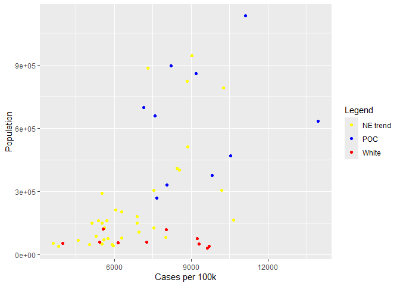
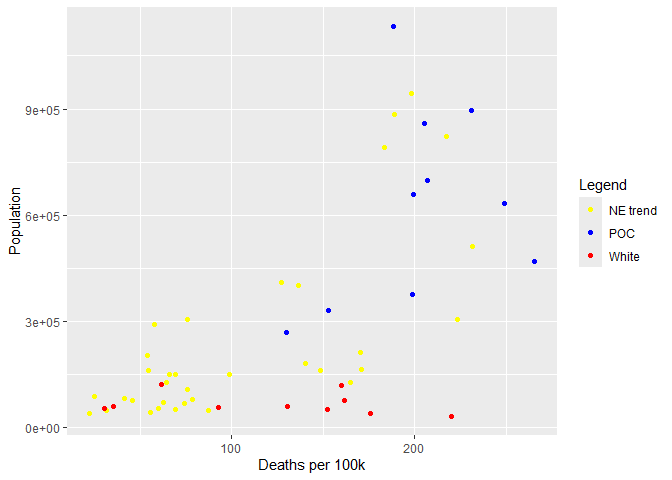
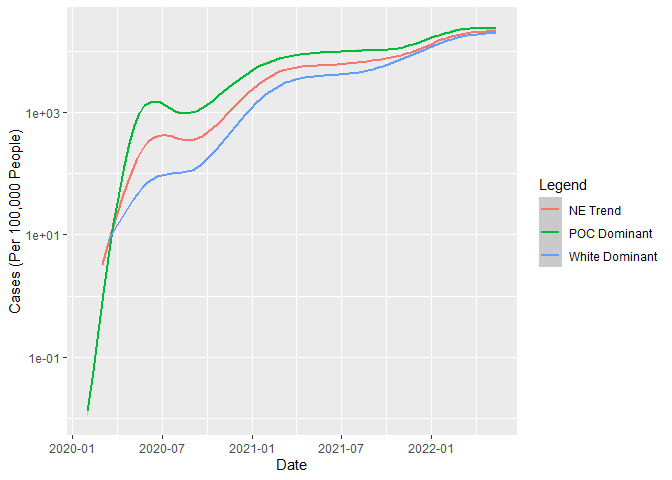
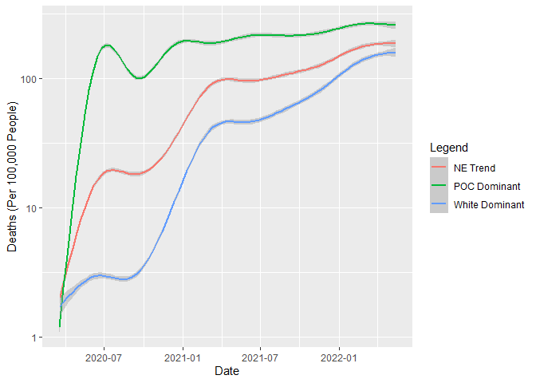
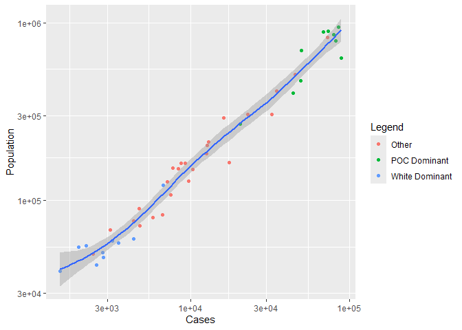
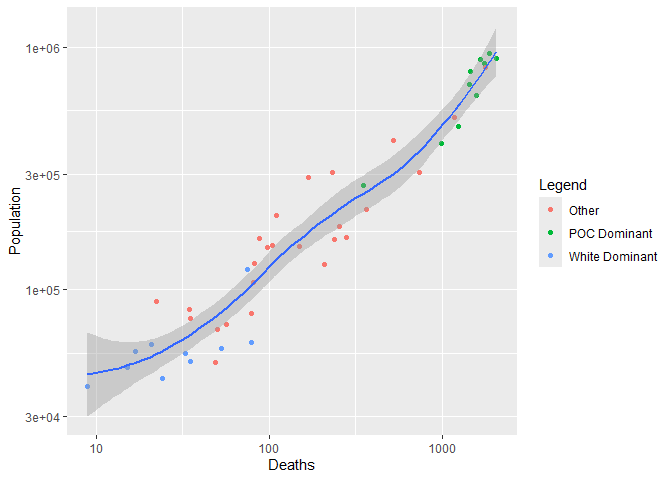
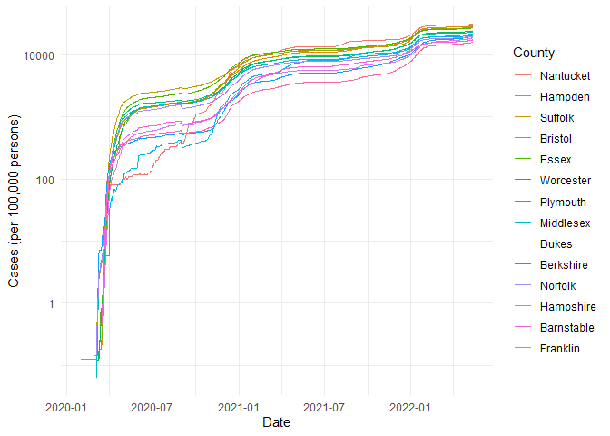

COVID-19
================
(Your name here)
2020-

- [Grading Rubric](#grading-rubric)
  - [Individual](#individual)
  - [Submission](#submission)
- [The Big Picture](#the-big-picture)
- [Get the Data](#get-the-data)
  - [Navigating the Census Bureau](#navigating-the-census-bureau)
    - [**q1** Load Table `B01003` into the following tibble. Make sure
      the column names are
      `id, Geographic Area Name, Estimate!!Total, Margin of Error!!Total`.](#q1-load-table-b01003-into-the-following-tibble-make-sure-the-column-names-are-id-geographic-area-name-estimatetotal-margin-of-errortotal)
  - [Automated Download of NYT Data](#automated-download-of-nyt-data)
    - [**q2** Visit the NYT GitHub repo and find the URL for the **raw**
      US County-level data. Assign that URL as a string to the variable
      below.](#q2-visit-the-nyt-github-repo-and-find-the-url-for-the-raw-us-county-level-data-assign-that-url-as-a-string-to-the-variable-below)
- [Join the Data](#join-the-data)
  - [**q3** Process the `id` column of `df_pop` to create a `fips`
    column.](#q3-process-the-id-column-of-df_pop-to-create-a-fips-column)
  - [**q4** Join `df_covid` with `df_q3` by the `fips` column. Use the
    proper type of join to preserve *only* the rows in
    `df_covid`.](#q4-join-df_covid-with-df_q3-by-the-fips-column-use-the-proper-type-of-join-to-preserve-only-the-rows-in-df_covid)
- [Analyze](#analyze)
  - [Normalize](#normalize)
    - [**q5** Use the `population` estimates in `df_data` to normalize
      `cases` and `deaths` to produce per 100,000 counts \[3\]. Store
      these values in the columns `cases_per100k` and
      `deaths_per100k`.](#q5-use-the-population-estimates-in-df_data-to-normalize-cases-and-deaths-to-produce-per-100000-counts-3-store-these-values-in-the-columns-cases_per100k-and-deaths_per100k)
  - [Guided EDA](#guided-eda)
    - [**q6** Compute some summaries](#q6-compute-some-summaries)
    - [**q7** Find and compare the top
      10](#q7-find-and-compare-the-top-10)
  - [Self-directed EDA](#self-directed-eda)
    - [**q8** Drive your own ship: You’ve just put together a very rich
      dataset; you now get to explore! Pick your own direction and
      generate at least one punchline figure to document an interesting
      finding. I give a couple tips & ideas
      below:](#q8-drive-your-own-ship-youve-just-put-together-a-very-rich-dataset-you-now-get-to-explore-pick-your-own-direction-and-generate-at-least-one-punchline-figure-to-document-an-interesting-finding-i-give-a-couple-tips--ideas-below)
    - [Ideas](#ideas)
    - [Aside: Some visualization
      tricks](#aside-some-visualization-tricks)
    - [Geographic exceptions](#geographic-exceptions)
- [Notes](#notes)

*Purpose*: In this challenge, you’ll learn how to navigate the U.S.
Census Bureau website, programmatically download data from the internet,
and perform a county-level population-weighted analysis of current
COVID-19 trends. This will give you the base for a very deep
investigation of COVID-19, which we’ll build upon for Project 1.

<!-- include-rubric -->

# Grading Rubric

<!-- -------------------------------------------------- -->

Unlike exercises, **challenges will be graded**. The following rubrics
define how you will be graded, both on an individual and team basis.

## Individual

<!-- ------------------------- -->

| Category | Needs Improvement | Satisfactory |
|----|----|----|
| Effort | Some task **q**’s left unattempted | All task **q**’s attempted |
| Observed | Did not document observations, or observations incorrect | Documented correct observations based on analysis |
| Supported | Some observations not clearly supported by analysis | All observations clearly supported by analysis (table, graph, etc.) |
| Assessed | Observations include claims not supported by the data, or reflect a level of certainty not warranted by the data | Observations are appropriately qualified by the quality & relevance of the data and (in)conclusiveness of the support |
| Specified | Uses the phrase “more data are necessary” without clarification | Any statement that “more data are necessary” specifies which *specific* data are needed to answer what *specific* question |
| Code Styled | Violations of the [style guide](https://style.tidyverse.org/) hinder readability | Code sufficiently close to the [style guide](https://style.tidyverse.org/) |

## Submission

<!-- ------------------------- -->

Make sure to commit both the challenge report (`report.md` file) and
supporting files (`report_files/` folder) when you are done! Then submit
a link to Canvas. **Your Challenge submission is not complete without
all files uploaded to GitHub.**

``` r
library(tidyverse)
```

    ## ── Attaching core tidyverse packages ──────────────────────── tidyverse 2.0.0 ──
    ## ✔ dplyr     1.1.4     ✔ readr     2.1.5
    ## ✔ forcats   1.0.0     ✔ stringr   1.5.1
    ## ✔ ggplot2   3.5.1     ✔ tibble    3.2.1
    ## ✔ lubridate 1.9.4     ✔ tidyr     1.3.1
    ## ✔ purrr     1.0.2     
    ## ── Conflicts ────────────────────────────────────────── tidyverse_conflicts() ──
    ## ✖ dplyr::filter() masks stats::filter()
    ## ✖ dplyr::lag()    masks stats::lag()
    ## ℹ Use the conflicted package (<http://conflicted.r-lib.org/>) to force all conflicts to become errors

``` r
library(readxl) # For reading Excel sheets
```

*Background*:
[COVID-19](https://en.wikipedia.org/wiki/Coronavirus_disease_2019) is
the disease caused by the virus SARS-CoV-2. In 2020 it became a global
pandemic, leading to huge loss of life and tremendous disruption to
society. The New York Times (as of writing) publishes up-to-date data on
the progression of the pandemic across the United States—we will study
these data in this challenge.

*Optional Readings*: I’ve found this [ProPublica
piece](https://www.propublica.org/article/how-to-understand-covid-19-numbers)
on “How to understand COVID-19 numbers” to be very informative!

# The Big Picture

<!-- -------------------------------------------------- -->

We’re about to go through *a lot* of weird steps, so let’s first fix the
big picture firmly in mind:

We want to study COVID-19 in terms of data: both case counts (number of
infections) and deaths. We’re going to do a county-level analysis in
order to get a high-resolution view of the pandemic. Since US counties
can vary widely in terms of their population, we’ll need population
estimates in order to compute infection rates (think back to the
`Titanic` challenge).

That’s the high-level view; now let’s dig into the details.

# Get the Data

<!-- -------------------------------------------------- -->

1.  County-level population estimates (Census Bureau)
2.  County-level COVID-19 counts (New York Times)

## Navigating the Census Bureau

<!-- ------------------------- -->

**Steps**: Our objective is to find the 2018 American Community
Survey\[1\] (ACS) Total Population estimates, disaggregated by counties.
To check your results, this is Table `B01003`.

1.  Go to [data.census.gov](data.census.gov).
2.  Scroll down and click `View Tables`.
3.  Apply filters to find the ACS **Total Population** estimates,
    disaggregated by counties. I used the filters:

- `Topics > Populations and People > Counts, Estimates, and Projections > Population Total`
- `Geography > County > All counties in United States`

5.  Select the **Total Population** table and click the `Download`
    button to download the data; make sure to select the 2018 5-year
    estimates.
6.  Unzip and move the data to your `challenges/data` folder.

- Note that the data will have a crazy-long filename like
  `ACSDT5Y2018.B01003_data_with_overlays_2020-07-26T094857.csv`. That’s
  because metadata is stored in the filename, such as the year of the
  estimate (`Y2018`) and my access date (`2020-07-26`). **Your filename
  will vary based on when you download the data**, so make sure to copy
  the filename that corresponds to what you downloaded!

### **q1** Load Table `B01003` into the following tibble. Make sure the column names are `id, Geographic Area Name, Estimate!!Total, Margin of Error!!Total`.

*Hint*: You will need to use the `skip` keyword when loading these data!

``` r
## TASK: Load the census bureau data with the following tibble name.
## TASK: Load the census bureau data with the following tibble name.
filename <- "./data/Pop_Data.csv"
df_pop <- read_csv(filename, skip = 2, na = "*****", col_types = "ccd_d__", col_names = c("id", "Geographic Area Name", "Estimate!!Total", "Margin of Error!!Total"))
```

    ## Warning: One or more parsing issues, call `problems()` on your data frame for details,
    ## e.g.:
    ##   dat <- vroom(...)
    ##   problems(dat)

*Note*: You can find information on 1-year, 3-year, and 5-year estimates
[here](https://www.census.gov/programs-surveys/acs/guidance/estimates.html).
The punchline is that 5-year estimates are more reliable but less
current.

## Automated Download of NYT Data

<!-- ------------------------- -->

ACS 5-year estimates don’t change all that often, but the COVID-19 data
are changing rapidly. To that end, it would be nice to be able to
*programmatically* download the most recent data for analysis; that way
we can update our analysis whenever we want simply by re-running our
notebook. This next problem will have you set up such a pipeline.

The New York Times is publishing up-to-date data on COVID-19 on
[GitHub](https://github.com/nytimes/covid-19-data).

### **q2** Visit the NYT [GitHub](https://github.com/nytimes/covid-19-data) repo and find the URL for the **raw** US County-level data. Assign that URL as a string to the variable below.

``` r
## TASK: Find the URL for the NYT covid-19 county-level data
url_counties <- "https://raw.githubusercontent.com/nytimes/covid-19-data/master/us-counties.csv"
```

Once you have the url, the following code will download a local copy of
the data, then load the data into R.

``` r
## NOTE: No need to change this; just execute
## Set the filename of the data to download
filename_nyt <- "./data/nyt_counties.csv"

## Download the data locally
curl::curl_download(
        url_counties,
        destfile = filename_nyt
      )

## Loads the downloaded csv
df_covid <- read_csv(filename_nyt)
```

    ## Rows: 2502832 Columns: 6
    ## ── Column specification ────────────────────────────────────────────────────────
    ## Delimiter: ","
    ## chr  (3): county, state, fips
    ## dbl  (2): cases, deaths
    ## date (1): date
    ## 
    ## ℹ Use `spec()` to retrieve the full column specification for this data.
    ## ℹ Specify the column types or set `show_col_types = FALSE` to quiet this message.

You can now re-run the chunk above (or the entire notebook) to pull the
most recent version of the data. Thus you can periodically re-run this
notebook to check in on the pandemic as it evolves.

*Note*: You should feel free to copy-paste the code above for your own
future projects!

# Join the Data

<!-- -------------------------------------------------- -->

To get a sense of our task, let’s take a glimpse at our two data
sources.

``` r
## NOTE: No need to change this; just execute
df_pop %>% glimpse
```

    ## Rows: 3,220
    ## Columns: 4
    ## $ id                       <chr> "0500000US01001", "0500000US01003", "0500000U…
    ## $ `Geographic Area Name`   <chr> "Autauga County, Alabama", "Baldwin County, A…
    ## $ `Estimate!!Total`        <dbl> 55200, 208107, 25782, 22527, 57645, 10352, 20…
    ## $ `Margin of Error!!Total` <dbl> NA, NA, NA, NA, NA, NA, NA, NA, NA, NA, NA, N…

``` r
df_covid %>% glimpse
```

    ## Rows: 2,502,832
    ## Columns: 6
    ## $ date   <date> 2020-01-21, 2020-01-22, 2020-01-23, 2020-01-24, 2020-01-24, 20…
    ## $ county <chr> "Snohomish", "Snohomish", "Snohomish", "Cook", "Snohomish", "Or…
    ## $ state  <chr> "Washington", "Washington", "Washington", "Illinois", "Washingt…
    ## $ fips   <chr> "53061", "53061", "53061", "17031", "53061", "06059", "17031", …
    ## $ cases  <dbl> 1, 1, 1, 1, 1, 1, 1, 1, 1, 1, 1, 1, 1, 1, 1, 1, 1, 1, 1, 1, 1, …
    ## $ deaths <dbl> 0, 0, 0, 0, 0, 0, 0, 0, 0, 0, 0, 0, 0, 0, 0, 0, 0, 0, 0, 0, 0, …

To join these datasets, we’ll need to use [FIPS county
codes](https://en.wikipedia.org/wiki/FIPS_county_code).\[2\] The last
`5` digits of the `id` column in `df_pop` is the FIPS county code, while
the NYT data `df_covid` already contains the `fips`.

### **q3** Process the `id` column of `df_pop` to create a `fips` column.

``` r
## TASK: Create a `fips` column by extracting the county code
df_q3 <-
  df_pop %>% 
  mutate(fips = str_extract(id, "[^US]*$"))
head(df_q3)
```

    ## # A tibble: 6 × 5
    ##   id       `Geographic Area Name` `Estimate!!Total` Margin of Error!!Tot…¹ fips 
    ##   <chr>    <chr>                              <dbl>                  <dbl> <chr>
    ## 1 0500000… Autauga County, Alaba…             55200                     NA 01001
    ## 2 0500000… Baldwin County, Alaba…            208107                     NA 01003
    ## 3 0500000… Barbour County, Alaba…             25782                     NA 01005
    ## 4 0500000… Bibb County, Alabama               22527                     NA 01007
    ## 5 0500000… Blount County, Alabama             57645                     NA 01009
    ## 6 0500000… Bullock County, Alaba…             10352                     NA 01011
    ## # ℹ abbreviated name: ¹​`Margin of Error!!Total`

Use the following test to check your answer.

``` r
## NOTE: No need to change this
## Check known county
assertthat::assert_that(
              (df_q3 %>%
              filter(str_detect(`Geographic Area Name`, "Autauga County")) %>%
              pull(fips)) == "01001"
            )
```

    ## [1] TRUE

``` r
print("Very good!")
```

    ## [1] "Very good!"

### **q4** Join `df_covid` with `df_q3` by the `fips` column. Use the proper type of join to preserve *only* the rows in `df_covid`.

``` r
## TASK: Join df_covid and df_q3 by fips.
df_q4 <- merge(df_covid, df_q3, by = "fips")
```

Use the following test to check your answer.

``` r
## NOTE: No need to change this
if (!any(df_q4 %>% pull(fips) %>% str_detect(., "02105"), na.rm = TRUE)) {
  assertthat::assert_that(TRUE)
} else {
  print(str_c(
    "Your df_q4 contains a row for the Hoonah-Angoon Census Area (AK),",
    "which is not in df_covid. You used the incorrect join type.",
    sep = " "
  ))
  assertthat::assert_that(FALSE)
}
```

    ## [1] TRUE

``` r
# if (any(df_q4 %>% pull(fips) %>% str_detect(., "78010"), na.rm = TRUE)) {
#   assertthat::assert_that(TRUE)
# } else {
#   print(str_c(
#     "Your df_q4 does not include St. Croix, US Virgin Islands,",
#     "which is in df_covid. You used the incorrect join type.",
#     sep = " "
#   ))
#   assertthat::assert_that(FALSE)
# }
# 

print("Very good!")
```

    ## [1] "Very good!"

For convenience, I down-select some columns and produce more convenient
column names.

``` r
## NOTE: No need to change; run this to produce a more convenient tibble
df_data <-
  df_q4 %>%
  select(
    date,
    county,
    state,
    fips,
    cases,
    deaths,
    population = `Estimate!!Total`
  )
```

# Analyze

<!-- -------------------------------------------------- -->

Now that we’ve done the hard work of loading and wrangling the data, we
can finally start our analysis. Our first step will be to produce county
population-normalized cases and death counts. Then we will explore the
data.

## Normalize

<!-- ------------------------- -->

### **q5** Use the `population` estimates in `df_data` to normalize `cases` and `deaths` to produce per 100,000 counts \[3\]. Store these values in the columns `cases_per100k` and `deaths_per100k`.

``` r
## TASK: Normalize cases and deaths
df_normalized <-
  df_data %>% 
  mutate(cases_per100k = cases/population * 100000) %>% 
  mutate(deaths_per100k = deaths/population * 100000)
```

You may use the following test to check your work.

``` r
## NOTE: No need to change this
## Check known county data
if (any(df_normalized %>% pull(date) %>% str_detect(., "2020-01-21"))) {
  assertthat::assert_that(TRUE)
} else {
  print(str_c(
    "Date 2020-01-21 not found; did you download the historical data (correct),",
    "or just the most recent data (incorrect)?",
    sep = " "
  ))
  assertthat::assert_that(FALSE)
}
```

    ## [1] TRUE

``` r
if (any(df_normalized %>% pull(date) %>% str_detect(., "2022-05-13"))) {
  assertthat::assert_that(TRUE)
} else {
  print(str_c(
    "Date 2022-05-13 not found; did you download the historical data (correct),",
    "or a single year's data (incorrect)?",
    sep = " "
  ))
  assertthat::assert_that(FALSE)
}
```

    ## [1] TRUE

``` r
## Check datatypes
assertthat::assert_that(is.numeric(df_normalized$cases))
```

    ## [1] TRUE

``` r
assertthat::assert_that(is.numeric(df_normalized$deaths))
```

    ## [1] TRUE

``` r
assertthat::assert_that(is.numeric(df_normalized$population))
```

    ## [1] TRUE

``` r
assertthat::assert_that(is.numeric(df_normalized$cases_per100k))
```

    ## [1] TRUE

``` r
assertthat::assert_that(is.numeric(df_normalized$deaths_per100k))
```

    ## [1] TRUE

``` r
## Check that normalization is correct
assertthat::assert_that(
              abs(df_normalized %>%
               filter(
                 str_detect(county, "Snohomish"),
                 date == "2020-01-21"
               ) %>%
              pull(cases_per100k) - 0.127) < 1e-3
            )
```

    ## [1] TRUE

``` r
assertthat::assert_that(
              abs(df_normalized %>%
               filter(
                 str_detect(county, "Snohomish"),
                 date == "2020-01-21"
               ) %>%
              pull(deaths_per100k) - 0) < 1e-3
            )
```

    ## [1] TRUE

``` r
print("Excellent!")
```

    ## [1] "Excellent!"

## Guided EDA

<!-- ------------------------- -->

Before turning you loose, let’s complete a couple guided EDA tasks.

### **q6** Compute some summaries

Compute the mean and standard deviation for `cases_per100k` and
`deaths_per100k`. *Make sure to carefully choose **which rows** to
include in your summaries,* and justify why!

``` r
## TASK: Compute mean and sd for cases_per100k and deaths_per100k
df_normalized %>% 
  filter(deaths_per100k >= 0) %>% 
  filter(cases_per100k >= 0) %>% 
  summarise(
    mean_cases_per100k = mean(cases_per100k),
    sd_cases_per100k = sd(cases_per100k),
    mean_deaths_per100k = mean(deaths_per100k),
    sd_deaths_per100k = sd(deaths_per100k)
  )
```

    ##   mean_cases_per100k sd_cases_per100k mean_deaths_per100k sd_deaths_per100k
    ## 1           10093.54         8483.639            174.3095          158.9641

- Which rows did you pick?
  - I included any rows that had normalized death and case number that
    were above or equal to 0
- Why?
  - I wanted to make sure that the rows included actually had data
    values for finding the mean and sd of them. This eliminated all of
    the data that was for cities and not for counties.

### **q7** Find and compare the top 10

Find the top 10 counties in terms of `cases_per100k`, and the top 10 in
terms of `deaths_per100k`. Report the population of each county along
with the per-100,000 counts. Compare the counts against the mean values
you found in q6. Note any observations.

``` r
## TASK: Find the top 10 max cases_per100k counties; report populations as well
df_top10_cases <-
  df_normalized %>% 
  group_by(county) %>% 
  summarise(across(c(cases_per100k, population), max)) %>% 
  arrange(desc(cases_per100k)) %>% 
  slice(0:10)

## TASK: Find the top 10 deaths_per100k counties; report populations as well
df_top10_deaths <-
  df_normalized %>% 
  group_by(county) %>% 
  summarise(across(c(deaths_per100k, population), max)) %>%
  arrange(desc(deaths_per100k)) %>% 
  slice(0:10)

df_top10_cases
```

    ## # A tibble: 10 × 3
    ##    county                   cases_per100k population
    ##    <chr>                            <dbl>      <dbl>
    ##  1 Loving                         192157.        102
    ##  2 Chattahoochee                   69527.      10767
    ##  3 Nome Census Area                62922.       9925
    ##  4 Northwest Arctic Borough        62542.       7734
    ##  5 Crowley                         59449.       5630
    ##  6 Bethel Census Area              57439.      18040
    ##  7 Dewey                           54317.       5779
    ##  8 Dimmit                          54019.      10663
    ##  9 Jim Hogg                        50133.       5282
    ## 10 Kusilvak Census Area            49817.       8198

``` r
df_top10_deaths
```

    ## # A tibble: 10 × 3
    ##    county            deaths_per100k population
    ##    <chr>                      <dbl>      <dbl>
    ##  1 McMullen                   1360.        662
    ##  2 Galax city                 1175.       6638
    ##  3 Motley                     1125.       1156
    ##  4 Hancock                    1054.      75690
    ##  5 Emporia city               1022.       5381
    ##  6 Towns                      1016.      11417
    ##  7 Jerauld                     986.       2029
    ##  8 Loving                      980.        102
    ##  9 Robertson                   980.      69344
    ## 10 Martinsville city           946.      13101

**Observations**:

- For cases and deaths per 100k the top 10 counties are all over the
  mean which was expected and are more than sd away from the mean.
- Loving has more cases than people which could be due to the state
  worker who logged the data inputting the wrong amount or a large
  number of people being treated in the county. The county only has a
  population of 102 persons.
- When did these “largest values” occur?
  - I am not sure what this question is asking?
  - This primarily happens in small counties aka populations under
    (12k). It would be interesting to see what the access to medical
    care looks like in these small counties or what else is
    disproportionally affecting those groups

## Self-directed EDA

<!-- ------------------------- -->

### **q8** Drive your own ship: You’ve just put together a very rich dataset; you now get to explore! Pick your own direction and generate at least one punchline figure to document an interesting finding. I give a couple tips & ideas below:

### Ideas

<!-- ------------------------- -->

- Look for outliers.
- Try web searching for news stories in some of the outlier counties.
- Investigate relationships between county population and counts.
- Do a deep-dive on counties that are important to you (e.g. where you
  or your family live).
- Fix the *geographic exceptions* noted below to study New York City.
- Your own idea!

**DO YOUR OWN ANALYSIS HERE**

Question: What are the trends in data from only the counties in new
england? Specifically looking at dominantly white vs. dominantly POC
counties.

Sorting out the data to only have new England counties.

``` r
counties_NE = c("Middlesex","Fairfield","Hartford","New Haven","Worcester","Essex", "Suffolk","Norfolk", "Providence","Bristol","Plymouth","Hampden","Hillsborough","Rockingham","Cumberland","New London","Barnstable","York","Litchfield","Kent","Middlesex","Hampshire","Chittenden","Penobscot","Tolland","Merrimack","Berkshire","Washington","Strafford","Kennebec","Windham","Androscoggin","Grafton","Newport","Cheshire","Franklin","Aroostook","Belknap","Rutland","Washington","Oxford","Windsor","Hancock","Somerset","Bristol","Franklin","Carroll","Windham","Sullivan","Knox")

df_normalized_NE <-
  df_normalized %>% 
  filter(state %in% c("Connecticut", "Maine", "Massachusetts", "New Hampshire", "Rhode Island", "Vermont")) %>% 
  filter(county %in% counties_NE)
```

Now to look at the mean and sd in terms of deaths and cases in NE

``` r
df_normalized_NE %>% 
  filter(deaths_per100k >= 0) %>% 
  filter(cases_per100k >= 0) %>% 
  summarise( 
    mean_cases_per100k = mean(cases_per100k), 
    sd_cases_per100k = sd(cases_per100k), 
    mean_deaths_per100k = mean(deaths_per100k), 
    sd_deaths_per100k = sd(deaths_per100k) )
```

    ##   mean_cases_per100k sd_cases_per100k mean_deaths_per100k sd_deaths_per100k
    ## 1           6932.908         7003.859            116.1108          102.3012

Observation: It is important to note there that the mean cases per 100k
and mean deaths per 100k in New England is lower than the mean cases and
deaths over the entire country. The standard devisation for both is
lower as well.

Now find the rates for the 10 most white populated and 10 most populated
by POC in New England

``` r
white_county_names <- c("Carroll", "Somerset" , "Rutland", "Oxford", "Knox", "Sullivan", "Hancock", "Belknap", "Windsor", "Kennebec")

df_top10_cases_white_NE <-
  df_normalized %>% 
  group_by(county) %>% 
  filter(county %in% white_county_names) %>% 
  summarise(across(c(cases_per100k, population), mean)) %>% 
  arrange(desc(cases_per100k)) %>% 
  slice(0:10)

## TASK: Find the top 10 deaths_per100k counties; report populations as well
df_top10_deaths_white_NE <-
  df_normalized %>% 
  group_by(county) %>% 
  filter(county %in% white_county_names) %>% 
  summarise(across(c(deaths_per100k, population), mean)) %>%
  arrange(desc(deaths_per100k)) %>% 
  slice(0:10)

POC_county_names <- c("Suffolk", "Providence", "Hartford", "Fairfield", "Hampden", "New Haven", "Essex", "Middlesex", "New London", "Norfolk")

df_top10_cases_POC_NE <-
  df_normalized %>% 
  group_by(county) %>% 
  filter(county %in% POC_county_names) %>% 
  summarise(across(c(cases_per100k, population), mean)) %>% 
  arrange(desc(cases_per100k)) %>% 
  slice(0:10)

## TASK: Find the top 10 deaths_per100k counties; report populations as well
df_top10_deaths_POC_NE <-
  df_normalized %>% 
  group_by(county) %>% 
  filter(county %in% POC_county_names) %>% 
  summarise(across(c(deaths_per100k, population), mean)) %>%
  arrange(desc(deaths_per100k)) %>% 
  slice(0:10)

df_top10_cases_POC_NE
```

    ## # A tibble: 10 × 3
    ##    county     cases_per100k population
    ##    <chr>              <dbl>      <dbl>
    ##  1 Providence        13961.    634533 
    ##  2 Suffolk           11125.   1132146.
    ##  3 Hampden           10530.    469116 
    ##  4 Fairfield          9822.    375998.
    ##  5 New Haven          9199.    859339 
    ##  6 Hartford           8206.    894730 
    ##  7 Essex              8054.    331632.
    ##  8 New London         7651.    268881 
    ##  9 Middlesex          7595.    657758.
    ## 10 Norfolk            7134.    698249

``` r
df_top10_cases_white_NE
```

    ## # A tibble: 10 × 3
    ##    county   cases_per100k population
    ##    <chr>            <dbl>      <dbl>
    ##  1 Carroll          9708.     40989.
    ##  2 Hancock          9631.     33631.
    ##  3 Sullivan         9298.     52235.
    ##  4 Knox             9243.     78729.
    ##  5 Somerset         8027.    120950.
    ##  6 Belknap          7270.     60640 
    ##  7 Oxford           6150.     57325 
    ##  8 Kennebec         5562.    121545 
    ##  9 Rutland          5436.     59273 
    ## 10 Windsor          3985.     55427

``` r
df_top10_deaths_POC_NE
```

    ## # A tibble: 10 × 3
    ##    county     deaths_per100k population
    ##    <chr>               <dbl>      <dbl>
    ##  1 Hampden              266.    469116 
    ##  2 Providence           249.    634533 
    ##  3 Hartford             231.    894730 
    ##  4 Norfolk              207.    698249 
    ##  5 New Haven            205.    859339 
    ##  6 Middlesex            199.    657758.
    ##  7 Fairfield            199.    375998.
    ##  8 Suffolk              188.   1132146.
    ##  9 Essex                153.    331632.
    ## 10 New London           130.    268881

``` r
df_top10_deaths_white_NE
```

    ## # A tibble: 10 × 3
    ##    county   deaths_per100k population
    ##    <chr>             <dbl>      <dbl>
    ##  1 Hancock           220.      33631.
    ##  2 Carroll           176.      40989.
    ##  3 Knox              162.      78729.
    ##  4 Somerset          160.     120950.
    ##  5 Sullivan          152.      52235.
    ##  6 Belknap           130.      60640 
    ##  7 Oxford             92.6     57325 
    ##  8 Kennebec           61.9    121545 
    ##  9 Rutland            35.3     59273 
    ## 10 Windsor            30.4     55427

Observations: The white majority counties tend to have lower populations
the POC dominant counties. The white dominant counties had lower cases
per100k than the POC dominant (White 9708-3985 vs. POC 13960-7133). This
is a noticeable different. POC dominant counties tended to have higher
deaths per 100k than the while dominant counties (White 220-30 vs POC
265-129)

``` r
df_normalized_NE %>% 
  group_by(county) %>% 
  summarise(across(c(cases_per100k, population), mean)) %>% 
  ggplot() +
  geom_point(aes(cases_per100k, population, color = "NE trend")) + 
  geom_point(data = df_top10_cases_POC_NE, aes(cases_per100k, population,color = "POC")) +
  geom_point(data = df_top10_cases_white_NE, aes(cases_per100k, population, color = "White")) + 
  labs(
    x = "Cases per 100k",
    y = "Population",
    color = "Legend") +
  scale_color_manual(values = c("NE trend" = "yellow", "POC" = "blue","White" = "red"))
```

<!-- -->

``` r
df_normalized_NE %>% 
  group_by(county) %>% 
  summarise(across(c(deaths_per100k, population), mean)) %>% 
  ggplot() +
  geom_point(aes(deaths_per100k, population, color = "NE trend")) +
  geom_point(data = df_top10_deaths_POC_NE, aes(deaths_per100k, population,color = "POC")) +
  geom_point(data = df_top10_deaths_white_NE, aes(deaths_per100k, population, color = "White")) + 
  labs(
    x = "Deaths per 100k",
    y = "Population",
    color = "Legend") +
  scale_color_manual(values = c("NE trend" = "yellow","POC" = "blue","White" = "red"))
```

<!-- -->

This graph is misleading because death per 100k is already taking into
consideration population so now Ill find a different way to display the
data.

``` r
df_normalized_NE <-
  df_normalized_NE %>%
  mutate("Race_Dominant" = case_when(
    county %in% white_county_names ~ "White Dominant",
    county %in% POC_county_names   ~ "POC Dominant",
    TRUE ~ "NE Trend"
  ))

df_normalized_NE %>%
  group_by(county) %>% 
  ggplot(aes(date,cases_per100k)) +
    geom_smooth(aes(color = Race_Dominant), linetype = 1) +
    scale_y_log10() +
    labs(
    x = "Date",
    y = "Cases (Per 100,000 People)",
    color = "Legend")
```

    ## `geom_smooth()` using method = 'gam' and formula = 'y ~ s(x, bs = "cs")'

<!-- -->

``` r
df_normalized_NE %>%
  group_by(county) %>% 
  ggplot(aes(date,deaths_per100k)) +
    geom_smooth(aes(color = Race_Dominant), linetype = 1) +
    scale_y_log10() +
    labs(
    x = "Date",
    y = "Deaths (Per 100,000 People)",
    color = "Legend")
```

    ## Warning in scale_y_log10(): log-10 transformation introduced infinite values.

    ## `geom_smooth()` using method = 'gam' and formula = 'y ~ s(x, bs = "cs")'

    ## Warning: Removed 2104 rows containing non-finite outside the scale range
    ## (`stat_smooth()`).

<!-- -->

This graphs shows that the top ten POC dominant counties (green) trended
to have a higher case rate per 100,000 persons than the general NE
county trend and the top twn White dominant county trend. The second
graph shows that this trend is the same for the number of deaths per
100,000 people in POC vs. NE trend vs. White counties. It would be
interesting to look into what the access to medical care and
vaccinations look like in each of these counties.

Extra work things I looked into but didn’t use for my final analysis.
Look at it if you please! Lets look at the non-normalized data:

``` r
df_data_NE <-
  df_data %>% 
  filter(state %in% c("Connecticut", "Maine", "Massachusetts", "New Hampshire", "Rhode Island", "Vermont")) %>% 
  filter(county %in% counties_NE)

df_data_NE %>% 
  filter(deaths >= 0) %>% 
  filter(cases>= 0) %>% 
  summarise( 
    mean_cases  = mean(cases), 
    sd_cases    = sd(cases), 
    mean_deaths = mean(deaths), 
    sd_deathsk  = sd(deaths)
    )
```

    ##   mean_cases sd_cases mean_deaths sd_deathsk
    ## 1   23094.41 42932.54    484.4827   806.5933

``` r
#Add in collum for if white_county_names, POC_county_names, or other to the df_data_NE data set

df_data_NE_Race <-
  df_data_NE %>%
  mutate("Race_Dominant" = case_when(
    county %in% white_county_names ~ "White Dominant",
    county %in% POC_county_names   ~ "POC Dominant",
    TRUE ~ "Other"
  ))

df_data_NE_Race %>%
  group_by(county, Race_Dominant) %>% 
  summarise(across(c(cases, population), mean)) %>% 
  ggplot(aes(cases, population)) +
    geom_point(aes(color = Race_Dominant)) + 
    geom_smooth() + 
    scale_y_log10() + 
    scale_x_log10() + 
    labs(
     x = "Cases",
     y = "Population",
     color = "Legend"
     )
```

    ## `summarise()` has grouped output by 'county'. You can override using the
    ## `.groups` argument.
    ## `geom_smooth()` using method = 'loess' and formula = 'y ~ x'

<!-- -->

``` r
df_data_NE_Race %>%
  group_by(county, Race_Dominant) %>% 
  summarise(across(c(deaths, population), mean)) %>% 
  ggplot(aes(deaths, population)) +
    geom_point(aes(color = Race_Dominant)) + 
    geom_smooth() + 
    scale_y_log10() + 
    scale_x_log10() +
    labs(
     x = "Deaths",
     y = "Population",
     color = "Legend"
     )
```

    ## `summarise()` has grouped output by 'county'. You can override using the
    ## `.groups` argument.
    ## `geom_smooth()` using method = 'loess' and formula = 'y ~ x'

<!-- -->

### Aside: Some visualization tricks

<!-- ------------------------- -->

These data get a little busy, so it’s helpful to know a few `ggplot`
tricks to help with the visualization. Here’s an example focused on
Massachusetts.

``` r
## NOTE: No need to change this; just an example
df_normalized %>%
  filter(
    state == "Massachusetts", # Focus on Mass only
    !is.na(fips), # fct_reorder2 can choke with missing data
  ) %>%

  ggplot(
    aes(date, cases_per100k, color = fct_reorder2(county, date, cases_per100k))
  ) +
  geom_line() +
  scale_y_log10() +
  scale_color_discrete(name = "County") +
  theme_minimal() +
  labs(
    x = "Date",
    y = "Cases (per 100,000 persons)"
  )
```

<!-- -->

*Tricks*:

- I use `fct_reorder2` to *re-order* the color labels such that the
  color in the legend on the right is ordered the same as the vertical
  order of rightmost points on the curves. This makes it easier to
  reference the legend.
- I manually set the `name` of the color scale in order to avoid
  reporting the `fct_reorder2` call.
- I use `scales::label_number_si` to make the vertical labels more
  readable.
- I use `theme_minimal()` to clean up the theme a bit.
- I use `labs()` to give manual labels.

### Geographic exceptions

<!-- ------------------------- -->

The NYT repo documents some [geographic
exceptions](https://github.com/nytimes/covid-19-data#geographic-exceptions);
the data for New York, Kings, Queens, Bronx and Richmond counties are
consolidated under “New York City” *without* a fips code. Thus the
normalized counts in `df_normalized` are `NA`. To fix this, you would
need to merge the population data from the New York City counties, and
manually normalize the data.

# Notes

<!-- -------------------------------------------------- -->

\[1\] The census used to have many, many questions, but the ACS was
created in 2010 to remove some questions and shorten the census. You can
learn more in [this wonderful visual
history](https://pudding.cool/2020/03/census-history/) of the census.

\[2\] FIPS stands for [Federal Information Processing
Standards](https://en.wikipedia.org/wiki/Federal_Information_Processing_Standards);
these are computer standards issued by NIST for things such as
government data.

\[3\] Demographers often report statistics not in percentages (per 100
people), but rather in per 100,000 persons. This is [not always the
case](https://stats.stackexchange.com/questions/12810/why-do-demographers-give-rates-per-100-000-people)
though!
