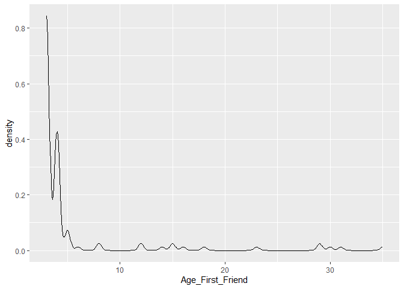
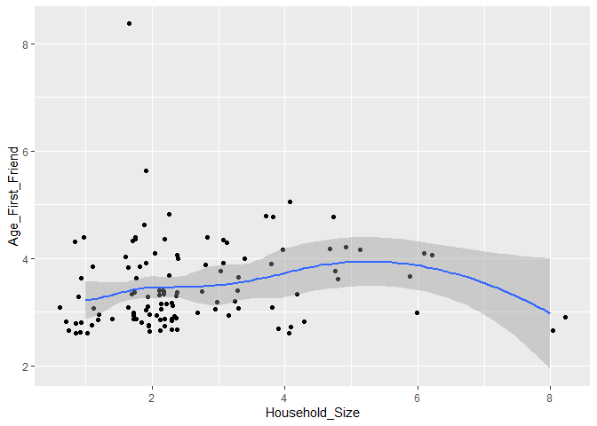
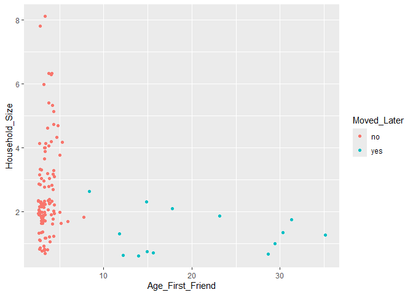
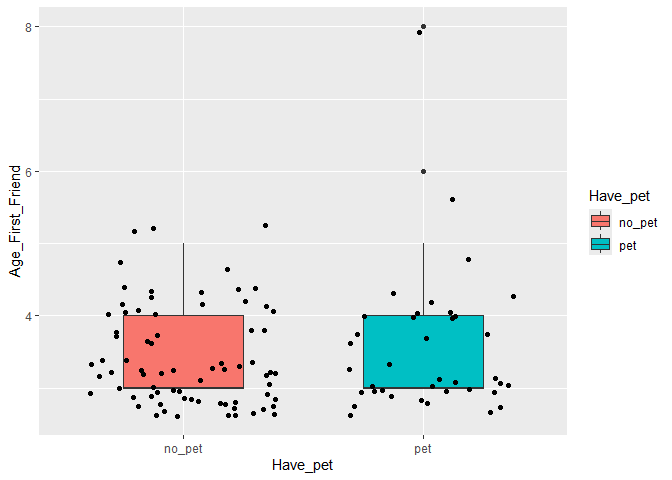
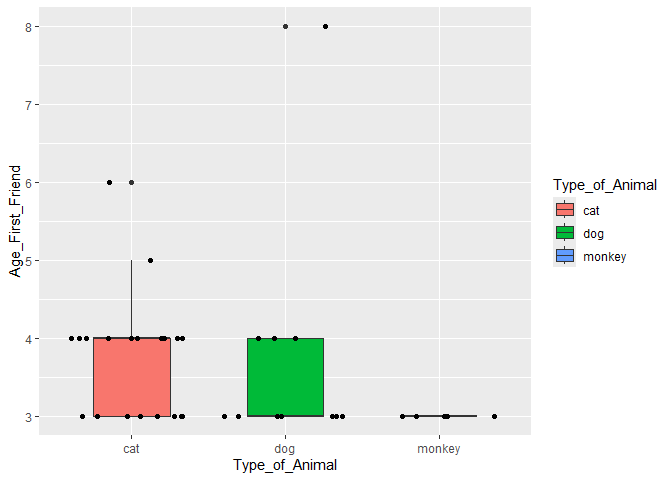
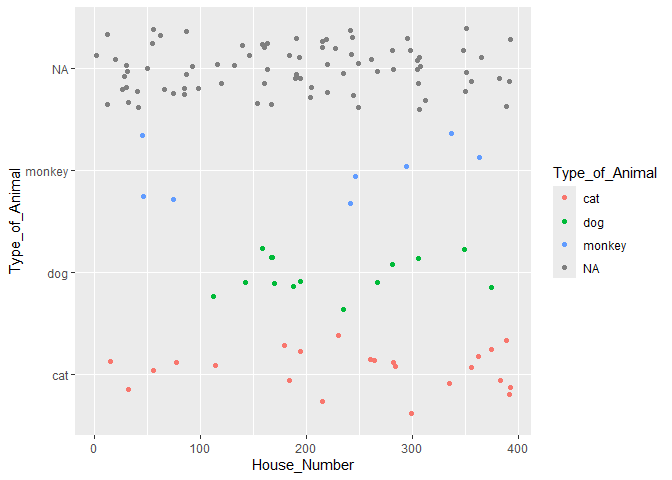

The Islands, Part 2: Study
================
Maya, Sparsh, Maya, Oliver, and Leslie
2025-04-10

- [Grading Rubric](#grading-rubric)
  - [Individual](#individual)
  - [Submission](#submission)
- [Setup](#setup)
  - [**q1** Planning a study (TEAMWORK)](#q1-planning-a-study-teamwork)
  - [**q2** EDA](#q2-eda)
  - [**q3** Key Analyses](#q3-key-analyses)
  - [**q4** Answers](#q4-answers)

*Purpose*: This is part 2 of 2. In part 1 you *planed* your statistical
project, particularly your data collection. In this part you will give
updates on your plan, and report your findings.

This challenge is deliberately shorter so you have time to collect and
analyze your data.

*Important note*: While we expect that you did your data collection with
your team, you need to complete your own individual report for c10.

<!-- include-rubric -->

# Grading Rubric

<!-- -------------------------------------------------- -->

Unlike exercises, **challenges will be graded**. The following rubrics
define how you will be graded, both on an individual and team basis.

## Individual

<!-- ------------------------- -->

| Category | Needs Improvement | Satisfactory |
|----|----|----|
| Effort | Some task **q**’s left unattempted | All task **q**’s attempted |
| Observed | Did not document observations, or observations incorrect | Documented correct observations based on analysis |
| Supported | Some observations not clearly supported by analysis | All observations clearly supported by analysis (table, graph, etc.) |
| Assessed | Observations include claims not supported by the data, or reflect a level of certainty not warranted by the data | Observations are appropriately qualified by the quality & relevance of the data and (in)conclusiveness of the support |
| Specified | Uses the phrase “more data are necessary” without clarification | Any statement that “more data are necessary” specifies which *specific* data are needed to answer what *specific* question |
| Code Styled | Violations of the [style guide](https://style.tidyverse.org/) hinder readability | Code sufficiently close to the [style guide](https://style.tidyverse.org/) |

## Submission

<!-- ------------------------- -->

Make sure to commit both the challenge report (`report.md` file) and
supporting files (`report_files/` folder) when you are done! Then submit
a link to Canvas. **Your Challenge submission is not complete without
all files uploaded to GitHub.**

# Setup

<!-- ----------------------------------------------------------------------- -->

``` r
library(tidyverse)
```

    ## ── Attaching core tidyverse packages ──────────────────────── tidyverse 2.0.0 ──
    ## ✔ dplyr     1.1.4     ✔ readr     2.1.5
    ## ✔ forcats   1.0.0     ✔ stringr   1.5.1
    ## ✔ ggplot2   3.5.1     ✔ tibble    3.2.1
    ## ✔ lubridate 1.9.4     ✔ tidyr     1.3.1
    ## ✔ purrr     1.0.2     
    ## ── Conflicts ────────────────────────────────────────── tidyverse_conflicts() ──
    ## ✖ dplyr::filter() masks stats::filter()
    ## ✖ dplyr::lag()    masks stats::lag()
    ## ℹ Use the conflicted package (<http://conflicted.r-lib.org/>) to force all conflicts to become errors

``` r
library(rsample)

# TODO: Include any other packages you need
```

### **q1** Planning a study (TEAMWORK)

While you provided this plan in c08 (Part 1), please include your plan
here. In particular, describe how you updated your plan in response to
feedback.

#### **Population**

- (What population are you going to study?)

  - We studied adult residents of Talu 

#### **Quantity of interest**

- The age at which individuals made their first friend

- Whether they currently have a pet

- If they had a pet, what type of pets was it

- Household size

#### **Covariates**

- Age of the person (must be an adult)

- Consent to being studied

#### **Observation or experiment?**

The Islands allows you to ask islanders to complete tasks. If you just
take measurements on your participants, then it’s an observational
study. But if you also introduce something that’s meant to change the
outcome of a measurement (e.g., drinking coffee before taking a test),
that’s called an experimental study. You need to decide whether your
study is observational or experimental.

- This is an observational study, as we are only collecting survey data
  without manipulating any variables.

#### **Question / Hypothesis**

- (Write your question / hypothesis here)

  - Question: Is there a relationship between the age at which
    individuals made their first friend and their likelihood of having a
    pet?

  - Hypothesis: People who made their first friend at a younger age may
    be more likely to have a pet, as early socialization skills might
    correlate with pet ownership.

#### **Sampling plan**

- (What steps will you take to collect the data?)

  - We randomly selected a sample of residents from the Talu. We
    randomly generate 100 house numbers from the island and will take
    data from only those houses. We only surveyed houses that had
    someone currently living there. We only took data from adults (18
    and above)

- (How will you ensure the data is representative of your chosen
  population?)

  - We will ensure that our sample includes people across different age
    groups and household sizes.

  - If needed, we will compare our sample’s demographics to city-wide
    demographics to check for bias.

- (How will you choose your sample size?)

  - We chose to look at 100 household. This is roughly 25% percent of
    the Island since there are a total of 397 houses. 

### **q2** EDA

Conduct an EDA on your data. Add as many code chunks as you need. Ensure
your EDA gives enough context of the data for us to understand what
comes next in this report.

#### This code is commented out but was the first part of exploring our data

``` r
filename_islands <- "./data/Data_C10.csv"

df_islands <-
   read_csv(
     filename_islands
   )
```

    ## Rows: 158 Columns: 10
    ## ── Column specification ────────────────────────────────────────────────────────
    ## Delimiter: ","
    ## chr (6): Data_Taker, Name, Consent, Moved_Later, Have_pet, Type_of_Animal
    ## dbl (4): House_Number, Age, Age_First_Friend, Household_Size
    ## 
    ## ℹ Use `spec()` to retrieve the full column specification for this data.
    ## ℹ Specify the column types or set `show_col_types = FALSE` to quiet this message.

``` r
# 
# df_islands %>% 
#   filter(Consent == "yes") %>% 
#   arrange(desc(Age_First_Friend)) %>% 
#   ggplot(aes(x  = Age_First_Friend, fill = Have_pet)) +
#   geom_bar(position = "dodge") 
# 
# df_islands %>% 
#   filter(Consent == "yes") %>% 
#   arrange(desc(Age)) %>% 
#   ggplot(aes(x  = Age, y = Age_First_Friend, color = Have_pet)) +
#   geom_jitter()
# 
# df_islands %>% 
#   filter(Consent == "yes") %>% 
#   arrange(desc(Age)) %>% 
#   ggplot(aes(x  = Age_First_Friend, y = Household_Size, color = Have_pet)) +
#   geom_jitter()
# 
# df_islands %>% 
#   filter(Consent == "yes") %>% 
#   arrange(desc(Age)) %>% 
#   ggplot(aes(x  = Age_First_Friend, y = Household_Size, color = Moved_Later)) +
#   geom_jitter()
# 
# df_islands %>% 
#    filter(Consent == "yes") %>% 
#    filter(Have_pet == "pet") %>% 
#    filter(Moved_Later == "no") %>% 
#    ggplot(aes(x  = Type_of_Animal, y = Age)) +
#    geom_boxplot()
# 
# df_islands %>% 
#   filter(Consent == "yes") %>% 
#   ggplot(aes(x = Age)) +
#   geom_histogram(bins = 20)
```

This is the code for the EDA final visuals:

``` r
#age of first friend
df_islands %>% 
  filter(Consent == "yes") %>% 
  ggplot(aes(x = Age_First_Friend)) +
  geom_density()
```

<!-- -->

``` r
#household size
df_islands %>% 
  filter(Consent == "yes") %>% 
  ggplot(aes(x = Household_Size)) +
  geom_bar()
```

<!-- -->

``` r
#age of first friend
df_islands %>% 
  filter(Consent == "yes") %>% 
  filter(Moved_Later == "no") %>% 
  ggplot(aes(x = Household_Size, y = Age_First_Friend)) +
  geom_jitter() +
  geom_smooth()
```

    ## `geom_smooth()` using method = 'loess' and formula = 'y ~ x'

    ## Warning in simpleLoess(y, x, w, span, degree = degree, parametric = parametric,
    ## : pseudoinverse used at 0.965

    ## Warning in simpleLoess(y, x, w, span, degree = degree, parametric = parametric,
    ## : neighborhood radius 2.035

    ## Warning in simpleLoess(y, x, w, span, degree = degree, parametric = parametric,
    ## : reciprocal condition number 3.7196e-16

    ## Warning in simpleLoess(y, x, w, span, degree = degree, parametric = parametric,
    ## : There are other near singularities as well. 1

    ## Warning in predLoess(object$y, object$x, newx = if (is.null(newdata)) object$x
    ## else if (is.data.frame(newdata))
    ## as.matrix(model.frame(delete.response(terms(object)), : pseudoinverse used at
    ## 0.965

    ## Warning in predLoess(object$y, object$x, newx = if (is.null(newdata)) object$x
    ## else if (is.data.frame(newdata))
    ## as.matrix(model.frame(delete.response(terms(object)), : neighborhood radius
    ## 2.035

    ## Warning in predLoess(object$y, object$x, newx = if (is.null(newdata)) object$x
    ## else if (is.data.frame(newdata))
    ## as.matrix(model.frame(delete.response(terms(object)), : reciprocal condition
    ## number 3.7196e-16

    ## Warning in predLoess(object$y, object$x, newx = if (is.null(newdata)) object$x
    ## else if (is.data.frame(newdata))
    ## as.matrix(model.frame(delete.response(terms(object)), : There are other near
    ## singularities as well. 1

<!-- -->

``` r
#AGE FIRST FIREND, MOVED LATER, HOUSEHOLD SIZE
df_islands %>% 
  filter(Consent == "yes") %>% 
  arrange(desc(Age)) %>% 
  ggplot(aes(x  = Age_First_Friend, y = Household_Size, color = Moved_Later)) +
  geom_jitter()
```

<!-- -->

``` r
#HAVE PET AND AGE OF FIRST FRIEND

df_islands %>% 
  filter(Consent == "yes") %>% 
  filter(Moved_Later == "no") %>% 
  ggplot(aes(x  = Have_pet, y = Age_First_Friend)) +
  geom_boxplot(aes(fill = Have_pet), width = 0.5) +
  geom_jitter()
```

<!-- -->

``` r
df_islands %>% 
  filter(Consent == "yes") %>% 
  filter(Moved_Later == "no") %>% 
  filter(Have_pet == "pet") %>% 
  ggplot(aes(x  = Type_of_Animal, y = Age_First_Friend)) +
  geom_boxplot(aes(fill = Type_of_Animal), width = 0.5) +
  geom_jitter(height = 0)
```

<!-- -->

``` r
#Housenumber vs pet
df_islands %>% 
  filter(Consent == "yes") %>% 
  ggplot(aes(x  = House_Number, y = Type_of_Animal, color = Type_of_Animal)) +
  geom_jitter()
```

<!-- -->

### **q3** Key Analyses

Present the key analyses that support your questions / hypotheses. This
could include summary statistics (e.g., a proportion of Islanders),
grouped summary statistics (e.g., a proportion for group A, and for
group B), or visualizations (e.g., a histogram). This section should be
short, and every analysis should directly relate to q4.

- Graph 1

  - A strong majority of people on the island of Talu make their first
    friend at the age of 3 and 4.

  - There are a few outliers starting after the age of 6.

- Graph 2

  - The majority of households in this dataset are of 2-person size
    (approximately 60 households).

- Graph 3

  - This graph plots the age of first friend vs household size with data
    points where people who moved later in life to the island are not
    included in this plot.

  - There doesn’t seem to be a trend amongst these variables as the
    smooth line is very flat, except for household sizes between 6 to 8
    where it decreases slightly. However, there are very few data points
    within this range and this indicates an uncertainty in that range.
    So, no overall generalizations can be made.

- Graph 4

  - Most people who did not move later in life formed their first
    friendship at a young age (typically before age 7). However, this is
    not a trend and is unreliable because people who moved later in life
    probably had their first friendships earlier in life but we do not
    have that data. Therefore, those who moved later in life tend to
    have much later ages (after age 10) of their first friendship on the
    island.

  - We can notice a different trend in this plot though where people who
    moved later in life typically tend to have small household sizes
    (typically 1 or 2-person households). This indicates that people who
    move later in life to the island typically move alone or with their
    spouse. 

- Graph 5

  - Both groups (pet and no_pet) have a similar median age at which the
    first friend was made - around 3 years old.

  - The IQR for both groups is quite similar. This indicates not much
    variation in the age of first friendship across both groups.

- Graph 6

  - Cat owners have a median age of first friend around 4 years. Both
    dog and monkey owners also show a similar median age of first friend
    (around 3 years).

  - The cat and dog owners have a decent spread in ages, with IQRs from
    roughly 3 to 4 years. The monkey owners have a minimal spread which
    is because of very few observations in the dataset compared to cat
    and dog owners.

  - Cat and dog owners show some outliers with values for the age of
    first friend lying around 6 to 8 years.

  - The monkey owners group does not appear to have any extreme
    outliers.

  - Overall, no type of animal stands out when looking at the age at
    which a person makes their first friend, and hence, no strong trend
    is noticeable.

  - Monkey ownership might hint at a slightly younger first-friend ages,
    but this is not reliable due to the tiny group size.

- Graph 7

  - Animals of all types are evenly distributed across a wide range of
    house numbers (from 0 to 397) in the town of Talu.

  - Cat owners are evenly scattered across the houses.

  - Dog owners are also fairly spread out between houses 100 to 397, but
    seem to be slightly more clustered around house numbers 100 to 200.

  - Monkey owners are fewer in number compared to cat and dog owners.
    The observations are scattered irregularly throughout the dataset
    without a clear pattern.

  - The NA group denotes houses with no pets.

### **q4** Answers

Connect your Key Analyses to your questions / hypotheses. What did you
conclude from your study?

- Our question was whether there is a relationship between the age at
  which individuals made their first friend and their likelihood of
  having a pet? 

- Observations: 

  - Most people made their first friend around age 3 to 4.

  - People who own pets and those who do not make their first friends at
    similar ages.

  - There is no noticeable difference in age of first friendship across
    different types of pets (cat, dog, monkey).

  - People who moved later to the island reported older ages for first
    friendships, likely because we don’t have data on friendships before
    their move.

  - People who moved later tend to live in smaller households, often 1–2
    people.

  - Pet ownership appears to be evenly spread across the island, with
    some scattering and clustering for dog and monkey houses.

- Conclusion:

  - There is no evidence that the age at which someone made their first
    friend affects whether they own a pet.

  - Therefore, our hypothesis is not supported by the data.
